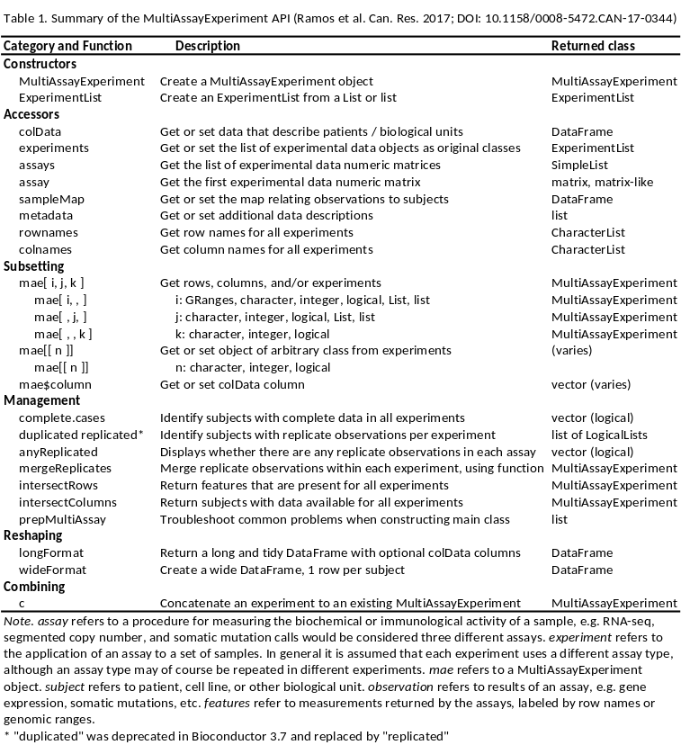
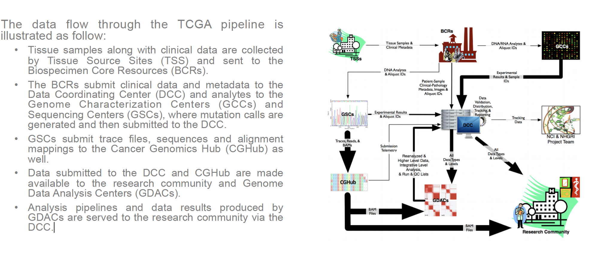
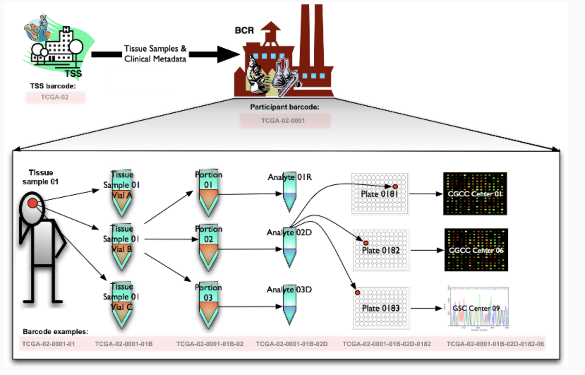
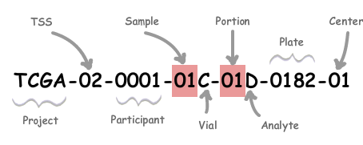
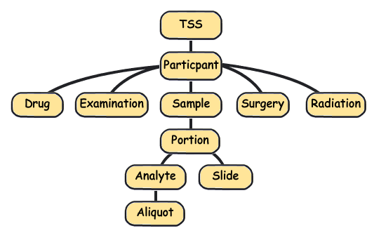

```r
  if (!"BiocManager" %in% rownames(installed.packages()))
       install.packages("BiocManager")
  BiocManager::install(c("SummarizedExperiment", "airway","MultiAssayExperiment","curatedTCGAData","TCGAutils"))
```


```r
library(SummarizedExperiment)
library(MultiAssayExperiment)
library(curatedTCGAData)
library(TCGAutils)
```

# (Ranged) SummarizedExperiment
The SummarizedExperiment class is used to store rectangular matrices of experimental results, which are commonly produced by sequencing and microarray experiments. Each object stores observations of one or more samples, along with additional meta-data describing both the observations (features) and samples (phenotypes).

A key aspect of the SummarizedExperiment class is the coordination of the meta-data and assays when subsetting. For example, if you want to exclude a given sample you can do for both the meta-data and assay in one operation, which ensures the meta-data and observed data will remain in sync. 


## Anatomy of a SummarizedExperiment
The SummarizedExperiment package contains two classes: SummarizedExperiment and  RangedSummarizedExperiment.

__SummarizedExperiment__ is a matrix-like container where rows represent features of interest (e.g. genes, transcripts, exons, etc.) and columns represent samples.
__The objects contain one or more assay, each represented by a matrix-like object of numeric or other type. All assays of the same SummarizedExperiment must have the same number of rows and columns.__
The rows of a SummarizedExperiment object represent features of interest. Information about these features is stored in a DataFrame object, accessible using the function __rowData()__. Each row of the  DataFrame provides information on the feature in the corresponding row of the  SummarizedExperiment object. Columns of the rowData() DataFrame represent different attributes of the features of interest, e.g., gene or transcript IDs, etc.
The columns of a SummarizedExperiment object rapresent samples. Information about samples are stored in the __colData()__ object.

__RangedSummarizedExperiment__ is the child of the SummarizedExperiment class which means that all the methods on SummarizedExperiment also work on a RangedSummarizedExperiment.

The fundamental difference between the two classes is that the rows of a RangedSummarizedExperiment object represent genomic ranges of interest instead of a  DataFrame of features. The RangedSummarizedExperiment ranges are described by a  GRanges or a GRangesList object, accessible using the __rowRanges()__ function.


```r
data(airway, package="airway")
air <- airway
air
```

```
## class: RangedSummarizedExperiment 
## dim: 64102 8 
## metadata(1): ''
## assays(1): counts
## rownames(64102): ENSG00000000003 ENSG00000000005 ... LRG_98 LRG_99
## rowData names(0):
## colnames(8): SRR1039508 SRR1039509 ... SRR1039520 SRR1039521
## colData names(9): SampleName cell ... Sample BioSample
```

```r
dim(air)
```

```
## [1] 64102     8
```

To retrieve the experiment data from a SummarizedExperiment object one can use the  __assays()__ accessor. An object can have multiple assay datasets each of which can be accessed using the $ operator. The airway dataset contains only one assay (counts). Here each row represents a gene transcript and each column one of the samples.


```r
head(assays(air)$counts)
```

```
##                 SRR1039508 SRR1039509 SRR1039512 SRR1039513 SRR1039516
## ENSG00000000003        679        448        873        408       1138
## ENSG00000000005          0          0          0          0          0
## ENSG00000000419        467        515        621        365        587
## ENSG00000000457        260        211        263        164        245
## ENSG00000000460         60         55         40         35         78
## ENSG00000000938          0          0          2          0          1
##                 SRR1039517 SRR1039520 SRR1039521
## ENSG00000000003       1047        770        572
## ENSG00000000005          0          0          0
## ENSG00000000419        799        417        508
## ENSG00000000457        331        233        229
## ENSG00000000460         63         76         60
## ENSG00000000938          0          0          0
```
There are two accessor functions for extracting the assay data from a SummarizedExperiment object. _assays()_ operates on the entire list of assay data as a whole, while _assay()_ operates on only one assay at a time.


```r
assays(air)
```

```
## List of length 1
## names(1): counts
```

```r
head(assays(air)[[1]])
```

```
##                 SRR1039508 SRR1039509 SRR1039512 SRR1039513 SRR1039516
## ENSG00000000003        679        448        873        408       1138
## ENSG00000000005          0          0          0          0          0
## ENSG00000000419        467        515        621        365        587
## ENSG00000000457        260        211        263        164        245
## ENSG00000000460         60         55         40         35         78
## ENSG00000000938          0          0          2          0          1
##                 SRR1039517 SRR1039520 SRR1039521
## ENSG00000000003       1047        770        572
## ENSG00000000005          0          0          0
## ENSG00000000419        799        417        508
## ENSG00000000457        331        233        229
## ENSG00000000460         63         76         60
## ENSG00000000938          0          0          0
```

```r
head(assay(air))
```

```
##                 SRR1039508 SRR1039509 SRR1039512 SRR1039513 SRR1039516
## ENSG00000000003        679        448        873        408       1138
## ENSG00000000005          0          0          0          0          0
## ENSG00000000419        467        515        621        365        587
## ENSG00000000457        260        211        263        164        245
## ENSG00000000460         60         55         40         35         78
## ENSG00000000938          0          0          2          0          1
##                 SRR1039517 SRR1039520 SRR1039521
## ENSG00000000003       1047        770        572
## ENSG00000000005          0          0          0
## ENSG00000000419        799        417        508
## ENSG00000000457        331        233        229
## ENSG00000000460         63         76         60
## ENSG00000000938          0          0          0
```

The __rowRanges()__ accessor is used to view the range information for a RangedSummarizedExperiment. (Note if this were the parent SummarizedExperiment class we’d use _rowData()_). The data are stored in a GRangesList object.


```r
rowRanges(air)
```

```
## GRangesList object of length 64102:
## $ENSG00000000003
## GRanges object with 17 ranges and 2 metadata columns:
##        seqnames            ranges strand |   exon_id       exon_name
##           <Rle>         <IRanges>  <Rle> | <integer>     <character>
##    [1]        X 99883667-99884983      - |    667145 ENSE00001459322
##    [2]        X 99885756-99885863      - |    667146 ENSE00000868868
##    [3]        X 99887482-99887565      - |    667147 ENSE00000401072
##    [4]        X 99887538-99887565      - |    667148 ENSE00001849132
##    [5]        X 99888402-99888536      - |    667149 ENSE00003554016
##    ...      ...               ...    ... .       ...             ...
##   [13]        X 99890555-99890743      - |    667156 ENSE00003512331
##   [14]        X 99891188-99891686      - |    667158 ENSE00001886883
##   [15]        X 99891605-99891803      - |    667159 ENSE00001855382
##   [16]        X 99891790-99892101      - |    667160 ENSE00001863395
##   [17]        X 99894942-99894988      - |    667161 ENSE00001828996
##   -------
##   seqinfo: 722 sequences (1 circular) from an unspecified genome
## 
## ...
## <64101 more elements>
```

Sample meta-data describing the samples can be accessed using __colData()__, and is a  _DataFrame_ that can store any number of descriptive columns for each sample row.


```r
colData(air)
```

```
## DataFrame with 8 rows and 9 columns
##            SampleName     cell      dex    albut        Run avgLength
##              <factor> <factor> <factor> <factor>   <factor> <integer>
## SRR1039508 GSM1275862   N61311    untrt    untrt SRR1039508       126
## SRR1039509 GSM1275863   N61311      trt    untrt SRR1039509       126
## SRR1039512 GSM1275866  N052611    untrt    untrt SRR1039512       126
## SRR1039513 GSM1275867  N052611      trt    untrt SRR1039513        87
## SRR1039516 GSM1275870  N080611    untrt    untrt SRR1039516       120
## SRR1039517 GSM1275871  N080611      trt    untrt SRR1039517       126
## SRR1039520 GSM1275874  N061011    untrt    untrt SRR1039520       101
## SRR1039521 GSM1275875  N061011      trt    untrt SRR1039521        98
##            Experiment    Sample    BioSample
##              <factor>  <factor>     <factor>
## SRR1039508  SRX384345 SRS508568 SAMN02422669
## SRR1039509  SRX384346 SRS508567 SAMN02422675
## SRR1039512  SRX384349 SRS508571 SAMN02422678
## SRR1039513  SRX384350 SRS508572 SAMN02422670
## SRR1039516  SRX384353 SRS508575 SAMN02422682
## SRR1039517  SRX384354 SRS508576 SAMN02422673
## SRR1039520  SRX384357 SRS508579 SAMN02422683
## SRR1039521  SRX384358 SRS508580 SAMN02422677
```

Meta-data describing the experimental methods and publication references can be accessed using  __metadata()__.


```r
metadata(air)
```

```
## [[1]]
## Experiment data
##   Experimenter name: Himes BE 
##   Laboratory: NA 
##   Contact information:  
##   Title: RNA-Seq transcriptome profiling identifies CRISPLD2 as a glucocorticoid responsive gene that modulates cytokine function in airway smooth muscle cells. 
##   URL: http://www.ncbi.nlm.nih.gov/pubmed/24926665 
##   PMIDs: 24926665 
## 
##   Abstract: A 226 word abstract is available. Use 'abstract' method.
```

Note that metadata() is just a simple list, so it is appropriate for any experiment wide metadata the user wishes to save, such as storing model formulas.


```r
metadata(air)$formula <- counts ~ dex + albut
metadata(air)
```

```
## [[1]]
## Experiment data
##   Experimenter name: Himes BE 
##   Laboratory: NA 
##   Contact information:  
##   Title: RNA-Seq transcriptome profiling identifies CRISPLD2 as a glucocorticoid responsive gene that modulates cytokine function in airway smooth muscle cells. 
##   URL: http://www.ncbi.nlm.nih.gov/pubmed/24926665 
##   PMIDs: 24926665 
## 
##   Abstract: A 226 word abstract is available. Use 'abstract' method.
## 
## $formula
## counts ~ dex + albut
```


## Constructing a SummarizedExperiment
Often, SummarizedExperiment or RangedSummarizedExperiment objects are returned by functions written by other packages. However it is possible to create them by hand with a call to the SummarizedExperiment() constructor.

Constructing a RangedSummarizedExperiment with a GRanges as the rowRanges argument:


```r
nrows <- 200
ncols <- 6
counts1 <- matrix(runif(nrows * ncols, 1, 2000), nrows)
counts2 <- matrix(runif(nrows * ncols, 1, 50), nrows)
rowRanges <- GRanges(rep(c("chr1", "chr2"), c(50, 150)),
                     IRanges(floor(runif(200, 1e5, 1e6)), width=100),
                     strand=sample(c("+", "-"), 200, TRUE),
                     feature_id=sprintf("ID%03d", 1:200))
colData <- DataFrame(Treatment=rep(c("ChIP", "Input"), 3),
                     row.names=LETTERS[1:6])

se=SummarizedExperiment(assays=list(exp1=counts1,exp2=counts2),
                     rowRanges=rowRanges, colData=colData)

head(assays(se)$exp2)
```

```
##             A         B         C        D        E        F
## [1,] 44.91795 49.798124 44.035120 37.63438 22.69582 19.03583
## [2,] 17.12341  5.126097 41.976161 49.81822 42.79126 35.08359
## [3,] 14.59814 19.379694 34.743176 47.64084 38.21969  6.12041
## [4,] 48.84674 13.576296 19.080141 48.78798 26.81728 48.07999
## [5,] 24.95770 14.016008  9.770923 19.71891 30.20723 35.62617
## [6,] 12.91431 35.171537 49.816596 33.04759 26.88928 15.77466
```

A SummarizedExperiment can be constructed with or without supplying a DataFrame for the rowData argument:


```r
SummarizedExperiment(assays=list(counts=counts1), colData=colData)
```

```
## class: SummarizedExperiment 
## dim: 200 6 
## metadata(0):
## assays(1): counts
## rownames: NULL
## rowData names(0):
## colnames(6): A B ... E F
## colData names(1): Treatment
```

Remember that the number of assay sizes must be equal, otherwise as in the following example the result is the error:

```r
counts1 <- matrix(runif(nrows * ncols, 1, 2000), 100) #100x12
counts2 <- matrix(runif(nrows * ncols, 1, 50), 50) #50x24
se=SummarizedExperiment(assays=list(exp1=counts1,exp2=counts2),
                     rowRanges=rowRanges, colData=colData)
```

```
## Error in method(object): all assays must have the same nrow and ncol
```


## Common operations on SummarizedExperiment
### Subsetting

Performs two dimensional subsetting, just like subsetting a matrix or data frame.

```r
# subset the first five transcripts and first three samples
air[1:5, 1:3]
```

```
## class: RangedSummarizedExperiment 
## dim: 5 3 
## metadata(2): '' formula
## assays(1): counts
## rownames(5): ENSG00000000003 ENSG00000000005 ENSG00000000419
##   ENSG00000000457 ENSG00000000460
## rowData names(0):
## colnames(3): SRR1039508 SRR1039509 SRR1039512
## colData names(9): SampleName cell ... Sample BioSample
```

Extracting the assay data from a SummarizedExperiment object.

```r
assays(air)[[1]][1:5, 1:5]
```

```
##                 SRR1039508 SRR1039509 SRR1039512 SRR1039513 SRR1039516
## ENSG00000000003        679        448        873        408       1138
## ENSG00000000005          0          0          0          0          0
## ENSG00000000419        467        515        621        365        587
## ENSG00000000457        260        211        263        164        245
## ENSG00000000460         60         55         40         35         78
```

```r
assay(air)[1:5, 1:5]
```

```
##                 SRR1039508 SRR1039509 SRR1039512 SRR1039513 SRR1039516
## ENSG00000000003        679        448        873        408       1138
## ENSG00000000005          0          0          0          0          0
## ENSG00000000419        467        515        621        365        587
## ENSG00000000457        260        211        263        164        245
## ENSG00000000460         60         55         40         35         78
```

Sample extraction/filtering on colData() columns with $ operator.

```r
air[, se$cell == "N61311"]
```

```
## class: RangedSummarizedExperiment 
## dim: 64102 0 
## metadata(2): '' formula
## assays(1): counts
## rownames(64102): ENSG00000000003 ENSG00000000005 ... LRG_98 LRG_99
## rowData names(0):
## colnames: NULL
## colData names(9): SampleName cell ... Sample BioSample
```

Filter on rowData().


```r
#Need to build a new SummarizedExperiment example
counts <- matrix(1:15, 5, 3, dimnames=list(LETTERS[1:5], LETTERS[1:3]))
counts
```

```
##   A  B  C
## A 1  6 11
## B 2  7 12
## C 3  8 13
## D 4  9 14
## E 5 10 15
```

```r
dates <- SummarizedExperiment(assays=list(counts=counts),
                              rowData=DataFrame(month=month.name[1:5], day=1:5))
dates
```

```
## class: SummarizedExperiment 
## dim: 5 3 
## metadata(0):
## assays(1): counts
## rownames(5): A B C D E
## rowData names(2): month day
## colnames(3): A B C
## colData names(0):
```

```r
# Subset all January assays
dates[rowData(dates)$month == "January", ]
```

```
## class: SummarizedExperiment 
## dim: 1 3 
## metadata(0):
## assays(1): counts
## rownames(1): A
## rowData names(2): month day
## colnames(3): A B C
## colData names(0):
```


### Range-based operations
SummarizedExperiment objects support all of the  findOverlaps() methods and associated functions. This includes subsetByOverlaps(), which makes it easy to subset a SummarizedExperiment object by an interval.


```r
roi <- GRanges(seqnames="1", ranges=100000:1100000)
subsetByOverlaps(air, roi)
```

```
## class: RangedSummarizedExperiment 
## dim: 74 8 
## metadata(2): '' formula
## assays(1): counts
## rownames(74): ENSG00000131591 ENSG00000177757 ... ENSG00000272512
##   ENSG00000273443
## rowData names(0):
## colnames(8): SRR1039508 SRR1039509 ... SRR1039520 SRR1039521
## colData names(9): SampleName cell ... Sample BioSample
```


# MultiAssayExperiment
MultiAssayExperiment offers a data structure for representing and analyzing multi-omics experiments: a biological analysis approach utilizing multiple types of observations, such as DNA mutations and abundance of RNA and proteins, in the same biological specimens.


A visual representation of the MultiAssayExperiment class and its accessor functions can be seen below. There are three main components: _ExperimentList_, _colData_, _sampleMap_.


A MultiAssayExperiment can contain any number of assays with different representations. Assays may be ID-based, where measurements are indexed identifiers of genes, microRNA, proteins, microbes, etc. Alternatively, assays may be range-based, where measurements correspond to genomic ranges that can be represented as GRanges objects, such as gene expression or copy number.
The following data classes have been tested to work as elements of a MultiAssayExperiment: _matrix_, _SummarizedExperiment_, _RangedSummarizedExperiment_, _RaggedExperiment_, _RangedVcfStack_, _DelayedMatrix_.

>For ID-based assays, there is no requirement that the same IDs be present for different experiments. For range-based assays, there is also no requirement that the same ranges be present for different experiments; furthermore, it is possible for different samples within an experiment to be represented by different ranges.__This is the main differences with SummarizedExperiment, where each assay must have the same dimension.__


```r
# Get started by trying out MultiAssayExperiment using a subset of the TCGA adrenocortical carcinoma (ACC) dataset provided with the package. 
data(miniACC)
miniACC
```

```
## A MultiAssayExperiment object of 5 listed
##  experiments with user-defined names and respective classes.
##  Containing an ExperimentList class object of length 5:
##  [1] RNASeq2GeneNorm: SummarizedExperiment with 198 rows and 79 columns
##  [2] gistict: SummarizedExperiment with 198 rows and 90 columns
##  [3] RPPAArray: SummarizedExperiment with 33 rows and 46 columns
##  [4] Mutations: matrix with 97 rows and 90 columns
##  [5] miRNASeqGene: SummarizedExperiment with 471 rows and 80 columns
## Features:
##  experiments() - obtain the ExperimentList instance
##  colData() - the primary/phenotype DFrame
##  sampleMap() - the sample availability DFrame
##  `$`, `[`, `[[` - extract colData columns, subset, or experiment
##  *Format() - convert into a long or wide DFrame
##  assays() - convert ExperimentList to a SimpleList of matrices
```

```r
rownames(miniACC)
```

```
## CharacterList of length 5
## [["RNASeq2GeneNorm"]] DIRAS3 MAPK14 YAP1 CDKN1B ... CHGA IDH3A SQSTM1 KCNJ13
## [["gistict"]] DIRAS3 MAPK14 YAP1 CDKN1B ERBB2 ... CHGA IDH3A SQSTM1 KCNJ13
## [["RPPAArray"]] G6PD IGFBP2 ASNS RBM15 PTEN ... PDK1 ERCC1 TFRC MSH2 PREX1
## [["Mutations"]] DIRAS3 G6PD KDR ERBB3 AKT1S1 ... PREX1 RET CDKN2A MACC1 CHGA
## [["miRNASeqGene"]] hsa-let-7a-1 hsa-let-7a-2 ... hsa-mir-99a hsa-mir-99b
```

```r
colnames(miniACC)
```

```
## CharacterList of length 5
## [["RNASeq2GeneNorm"]] TCGA-OR-A5J1-01A-11R-A29S-07 ...
## [["gistict"]] TCGA-OR-A5J1-01A-11D-A29H-01 ... TCGA-PK-A5HC-01A-11D-A309-01
## [["RPPAArray"]] TCGA-OR-A5J2-01A-21-A39K-20 ... TCGA-PK-A5HA-01A-21-A39K-20
## [["Mutations"]] TCGA-OR-A5J1-01A-11D-A29I-10 ... TCGA-PK-A5HC-01A-11D-A30A-10
## [["miRNASeqGene"]] TCGA-OR-A5J1-01A-11R-A29W-13 ...
```

## colData
The column names correspond to samples, and are used to match assay data to specimen metadata stored in _colData_.

The _colData_ dataset should be of class _DataFrame_ but can accept a _data.frame_ class object that will be coerced.

In order to relate metadata of the biological unit, the row names of the _colData_ dataset must contain patient identifiers.


```r
colData(miniACC)[1:4, 1:4]
```

```
## DataFrame with 4 rows and 4 columns
##                 patientID years_to_birth vital_status days_to_death
##               <character>      <integer>    <integer>     <integer>
## TCGA-OR-A5J1 TCGA-OR-A5J1             58            1          1355
## TCGA-OR-A5J2 TCGA-OR-A5J2             44            1          1677
## TCGA-OR-A5J3 TCGA-OR-A5J3             23            0            NA
## TCGA-OR-A5J4 TCGA-OR-A5J4             23            1           423
```

```r
table(miniACC$race)
```

```
## 
##                     asian black or african american                     white 
##                         2                         1                        78
```

Key points:

- __Each row maps to zero or more observations in each experiment in the ExperimentList (assays)__.

- One row per biological unit.

+ MultiAssayExperiment supports both missing observations and replicate observations, ie one row of colData can map to 0, 1, or more columns of any of the assays.

+ therefore you could treat replicate observations as one or multiple rows of _colData_.

+ multiple time points, or distinct biological replicates, should probably be separate rows of the _colData_.

## ExperimentList
The _ExperimentList_ slot and class is the container workhorse for the MultiAssayExperiment class. It contains all the experimental data (assays).

The datasets contained in elements of the ExperimentList can have: column names (required), row names (optional).


```r
# A base list or ExperimentList object 
experiments(miniACC)
```

```
## ExperimentList class object of length 5:
##  [1] RNASeq2GeneNorm: SummarizedExperiment with 198 rows and 79 columns
##  [2] gistict: SummarizedExperiment with 198 rows and 90 columns
##  [3] RPPAArray: SummarizedExperiment with 33 rows and 46 columns
##  [4] Mutations: matrix with 97 rows and 90 columns
##  [5] miRNASeqGene: SummarizedExperiment with 471 rows and 80 columns
```

```r
class(experiments(miniACC))
```

```
## [1] "ExperimentList"
## attr(,"package")
## [1] "MultiAssayExperiment"
```

```r
#Select single experiment
experiments(miniACC)[[1]] #RNASeq2GeneNorm
```

```
## class: SummarizedExperiment 
## dim: 198 79 
## metadata(3): experimentData annotation protocolData
## assays(1): exprs
## rownames(198): DIRAS3 MAPK14 ... SQSTM1 KCNJ13
## rowData names(0):
## colnames(79): TCGA-OR-A5J1-01A-11R-A29S-07 TCGA-OR-A5J2-01A-11R-A29S-07
##   ... TCGA-PK-A5HA-01A-11R-A29S-07 TCGA-PK-A5HB-01A-11R-A29S-07
## colData names(0):
```

```r
#Select single experiment
experiments(miniACC)[["gistict"]]
```

```
## class: SummarizedExperiment 
## dim: 198 90 
## metadata(0):
## assays(1): ''
## rownames(198): DIRAS3 MAPK14 ... SQSTM1 KCNJ13
## rowData names(3): Gene.Symbol Locus.ID Cytoband
## colnames(90): TCGA-OR-A5J1-01A-11D-A29H-01 TCGA-OR-A5J2-01A-11D-A29H-01
##   ... TCGA-PK-A5HB-01A-11D-A29H-01 TCGA-PK-A5HC-01A-11D-A309-01
## colData names(0):
```

```r
#Select multiple experiments
experiments(miniACC)[c(1,2)]
```

```
## ExperimentList class object of length 2:
##  [1] RNASeq2GeneNorm: SummarizedExperiment with 198 rows and 79 columns
##  [2] gistict: SummarizedExperiment with 198 rows and 90 columns
```
Key Points:

- One matrix-like dataset per list element
  
- One matrix column per assayed specimen. __Each matrix column must correspond to exactly one row of colData__: in other words, you must know which patient or cell line the observation came from. However, multiple columns can come from the same patient, or there can be no data for that patient.

- Matrix rows correspond to variables, e.g. genes or genomic ranges

## sampleMap: relating colData to multiple assays

The _sampleMap_ is a _DataFrame_ that relates the “primary” data (_colData_) to the experimental assays.
The _sampleMap_ provides an unambiguous map from every experimental observation to one and only one row in _colData_. It is, however, permissible for a row of _colData_ to be associated with multiple experimental observations or no observations at all. In other words, there is a  “many-to-one” mapping from experimental observations to rows of _colData_, and a “one-to-any-number” mapping from rows of _colData_ to experimental observations.

In simple cases where the column names of ExperimentList data matrices match the row names of colData, the user won’t need to specify or think about a sample map, it can be created automatically by the MultiAssayExperiment constructor.

sampleMap is a simple three-column DataFrame:

- __assay__ column: the name of the assay, and found in the names of ExperimentList list names

- __primary__ column: identifiers of patients or biological units, and found in the __row names of colData__

- __colname__ column: identifiers of assay results, and found in the __column names of ExperimentList elements__. 


```r
sampleMap(miniACC)
```

```
## DataFrame with 385 rows and 3 columns
##               assay      primary                      colname
##            <factor>  <character>                  <character>
## 1   RNASeq2GeneNorm TCGA-OR-A5J1 TCGA-OR-A5J1-01A-11R-A29S-07
## 2   RNASeq2GeneNorm TCGA-OR-A5J2 TCGA-OR-A5J2-01A-11R-A29S-07
## 3   RNASeq2GeneNorm TCGA-OR-A5J3 TCGA-OR-A5J3-01A-11R-A29S-07
## 4   RNASeq2GeneNorm TCGA-OR-A5J5 TCGA-OR-A5J5-01A-11R-A29S-07
## 5   RNASeq2GeneNorm TCGA-OR-A5J6 TCGA-OR-A5J6-01A-31R-A29S-07
## ...             ...          ...                          ...
## 381    miRNASeqGene TCGA-PA-A5YG TCGA-PA-A5YG-01A-11R-A29W-13
## 382    miRNASeqGene TCGA-PK-A5H8 TCGA-PK-A5H8-01A-11R-A29W-13
## 383    miRNASeqGene TCGA-PK-A5H9 TCGA-PK-A5H9-01A-11R-A29W-13
## 384    miRNASeqGene TCGA-PK-A5HA TCGA-PK-A5HA-01A-11R-A29W-13
## 385    miRNASeqGene TCGA-PK-A5HB TCGA-PK-A5HB-01A-11R-A29W-13
```

## metadata

Metadata can be used to keep additional information about patients, assays performed on individuals or on the entire cohort, or features such as genes, proteins, and genomic ranges. Metadata can be added at different levels of the MultiAssayExperiment.
Can be of ANY class, for storing study-wide metadata, such as citation information.


```r
metadata(miniACC)
```

```
## $title
## [1] "Comprehensive Pan-Genomic Characterization of Adrenocortical Carcinoma"
## 
## $PMID
## [1] "27165744"
## 
## $sourceURL
## [1] "http://s3.amazonaws.com/multiassayexperiments/accMAEO.rds"
## 
## $RPPAfeatureDataURL
## [1] "http://genomeportal.stanford.edu/pan-tcga/show_target_selection_file?filename=Allprotein.txt"
## 
## $colDataExtrasURL
## [1] "http://www.cell.com/cms/attachment/2062093088/2063584534/mmc3.xlsx"
```

## MultiAssayExperiment Subsetting

In pseudo code below, the subsetting operations work on the rows of the following indices: 1. _i_ experimental data rows 2. _j_ the primary names or the column names (entered as a list or List) 3. _k_ assay

```
multiassayexperiment[i = rownames, j = primary or colnames, k = assay]
```

Subsetting operations always return another MultiAssayExperiment. For example, the following will return any rows named _“MAPK14”_ or _“IGFBP2”_, and remove any assays where no rows match:

```r
miniACC[c("MAPK14", "IGFBP2"), , ]
```

```
## harmonizing input:
##   removing 170 sampleMap rows not in names(experiments)
```

```
## A MultiAssayExperiment object of 3 listed
##  experiments with user-defined names and respective classes.
##  Containing an ExperimentList class object of length 3:
##  [1] RNASeq2GeneNorm: SummarizedExperiment with 2 rows and 79 columns
##  [2] gistict: SummarizedExperiment with 2 rows and 90 columns
##  [3] RPPAArray: SummarizedExperiment with 1 rows and 46 columns
## Features:
##  experiments() - obtain the ExperimentList instance
##  colData() - the primary/phenotype DFrame
##  sampleMap() - the sample availability DFrame
##  `$`, `[`, `[[` - extract colData columns, subset, or experiment
##  *Format() - convert into a long or wide DFrame
##  assays() - convert ExperimentList to a SimpleList of matrices
```

The following will keep only patients of pathological _stage iv_, and all their associated assays:

```r
colnames(colData(miniACC))
```

```
##  [1] "patientID"                           
##  [2] "years_to_birth"                      
##  [3] "vital_status"                        
##  [4] "days_to_death"                       
##  [5] "days_to_last_followup"               
##  [6] "tumor_tissue_site"                   
##  [7] "pathologic_stage"                    
##  [8] "pathology_T_stage"                   
##  [9] "pathology_N_stage"                   
## [10] "gender"                              
## [11] "date_of_initial_pathologic_diagnosis"
## [12] "radiation_therapy"                   
## [13] "histological_type"                   
## [14] "residual_tumor"                      
## [15] "number_of_lymph_nodes"               
## [16] "race"                                
## [17] "ethnicity"                           
## [18] "Histology"                           
## [19] "C1A.C1B"                             
## [20] "mRNA_K4"                             
## [21] "MethyLevel"                          
## [22] "miRNA.cluster"                       
## [23] "SCNA.cluster"                        
## [24] "protein.cluster"                     
## [25] "COC"                                 
## [26] "OncoSign"                            
## [27] "purity"                              
## [28] "ploidy"                              
## [29] "genome_doublings"                    
## [30] "ADS"
```

```r
head(colData(miniACC))
```

```
## DataFrame with 6 rows and 30 columns
##                 patientID years_to_birth vital_status days_to_death
##               <character>      <integer>    <integer>     <integer>
## TCGA-OR-A5J1 TCGA-OR-A5J1             58            1          1355
## TCGA-OR-A5J2 TCGA-OR-A5J2             44            1          1677
## TCGA-OR-A5J3 TCGA-OR-A5J3             23            0            NA
## TCGA-OR-A5J4 TCGA-OR-A5J4             23            1           423
## TCGA-OR-A5J5 TCGA-OR-A5J5             30            1           365
## TCGA-OR-A5J6 TCGA-OR-A5J6             29            0            NA
##              days_to_last_followup tumor_tissue_site pathologic_stage
##                          <integer>       <character>      <character>
## TCGA-OR-A5J1                    NA           adrenal         stage ii
## TCGA-OR-A5J2                    NA           adrenal         stage iv
## TCGA-OR-A5J3                  2091           adrenal        stage iii
## TCGA-OR-A5J4                    NA           adrenal         stage iv
## TCGA-OR-A5J5                    NA           adrenal        stage iii
## TCGA-OR-A5J6                  2703           adrenal         stage ii
##              pathology_T_stage pathology_N_stage      gender
##                    <character>       <character> <character>
## TCGA-OR-A5J1                t2                n0        male
## TCGA-OR-A5J2                t3                n0      female
## TCGA-OR-A5J3                t3                n0      female
## TCGA-OR-A5J4                t3                n1      female
## TCGA-OR-A5J5                t4                n0        male
## TCGA-OR-A5J6                t2                n0      female
##              date_of_initial_pathologic_diagnosis radiation_therapy
##                                         <integer>       <character>
## TCGA-OR-A5J1                                 2000                no
## TCGA-OR-A5J2                                 2004                no
## TCGA-OR-A5J3                                 2008                no
## TCGA-OR-A5J4                                 2000                no
## TCGA-OR-A5J5                                 2000                no
## TCGA-OR-A5J6                                 2006                no
##                                 histological_type residual_tumor
##                                       <character>    <character>
## TCGA-OR-A5J1 adrenocortical carcinoma- usual type             r0
## TCGA-OR-A5J2 adrenocortical carcinoma- usual type             r2
## TCGA-OR-A5J3 adrenocortical carcinoma- usual type             r0
## TCGA-OR-A5J4 adrenocortical carcinoma- usual type             r2
## TCGA-OR-A5J5 adrenocortical carcinoma- usual type             r2
## TCGA-OR-A5J6 adrenocortical carcinoma- usual type             r0
##              number_of_lymph_nodes                      race          ethnicity
##                          <integer>               <character>        <character>
## TCGA-OR-A5J1                    NA                     white                 NA
## TCGA-OR-A5J2                     0                     white hispanic or latino
## TCGA-OR-A5J3                     0                     white hispanic or latino
## TCGA-OR-A5J4                     2                     white hispanic or latino
## TCGA-OR-A5J5                    NA                     white hispanic or latino
## TCGA-OR-A5J6                    NA black or african american hispanic or latino
##                Histology     C1A.C1B                              mRNA_K4
##              <character> <character>                          <character>
## TCGA-OR-A5J1  Usual Type         C1A steroid-phenotype-high+proliferation
## TCGA-OR-A5J2  Usual Type         C1A steroid-phenotype-high+proliferation
## TCGA-OR-A5J3  Usual Type         C1A               steroid-phenotype-high
## TCGA-OR-A5J4  Usual Type          NA                                   NA
## TCGA-OR-A5J5  Usual Type         C1A               steroid-phenotype-high
## TCGA-OR-A5J6  Usual Type         C1B                steroid-phenotype-low
##                     MethyLevel miRNA.cluster SCNA.cluster protein.cluster
##                    <character>   <character>  <character>       <integer>
## TCGA-OR-A5J1         CIMP-high       miRNA_1        Quiet              NA
## TCGA-OR-A5J2          CIMP-low       miRNA_1        Noisy               1
## TCGA-OR-A5J3 CIMP-intermediate       miRNA_6  Chromosomal               3
## TCGA-OR-A5J4         CIMP-high       miRNA_6  Chromosomal              NA
## TCGA-OR-A5J5 CIMP-intermediate       miRNA_2  Chromosomal              NA
## TCGA-OR-A5J6          CIMP-low       miRNA_1        Noisy               2
##                      COC    OncoSign    purity    ploidy genome_doublings
##              <character> <character> <numeric> <numeric>        <integer>
## TCGA-OR-A5J1        COC3         CN2       0.9      1.95                0
## TCGA-OR-A5J2        COC3    TP53/NF1      0.89      1.31                0
## TCGA-OR-A5J3        COC2         CN2      0.93      1.25                0
## TCGA-OR-A5J4          NA         CN1      0.87       2.6                1
## TCGA-OR-A5J5        COC2    TP53/NF1      0.93      2.75                1
## TCGA-OR-A5J6        COC1  TERT/ZNRF3      0.68      3.32                1
##                    ADS
##              <numeric>
## TCGA-OR-A5J1     -0.08
## TCGA-OR-A5J2     -0.84
## TCGA-OR-A5J3      1.18
## TCGA-OR-A5J4        NA
## TCGA-OR-A5J5        -1
## TCGA-OR-A5J6      1.11
```

```r
miniACC[, miniACC$pathologic_stage == "stage iv", ]
```

```
## A MultiAssayExperiment object of 5 listed
##  experiments with user-defined names and respective classes.
##  Containing an ExperimentList class object of length 5:
##  [1] RNASeq2GeneNorm: SummarizedExperiment with 198 rows and 15 columns
##  [2] gistict: SummarizedExperiment with 198 rows and 18 columns
##  [3] RPPAArray: SummarizedExperiment with 33 rows and 8 columns
##  [4] Mutations: matrix with 97 rows and 17 columns
##  [5] miRNASeqGene: SummarizedExperiment with 471 rows and 16 columns
## Features:
##  experiments() - obtain the ExperimentList instance
##  colData() - the primary/phenotype DFrame
##  sampleMap() - the sample availability DFrame
##  `$`, `[`, `[[` - extract colData columns, subset, or experiment
##  *Format() - convert into a long or wide DFrame
##  assays() - convert ExperimentList to a SimpleList of matrices
```

And the following will keep only the RNA-seq dataset, and only patients for which this assay is available:

```r
miniACC[, , "RNASeq2GeneNorm"]
```

```
## harmonizing input:
##   removing 306 sampleMap rows not in names(experiments)
##   removing 13 colData rownames not in sampleMap 'primary'
```

```
## A MultiAssayExperiment object of 1 listed
##  experiment with a user-defined name and respective class.
##  Containing an ExperimentList class object of length 1:
##  [1] RNASeq2GeneNorm: SummarizedExperiment with 198 rows and 79 columns
## Features:
##  experiments() - obtain the ExperimentList instance
##  colData() - the primary/phenotype DFrame
##  sampleMap() - the sample availability DFrame
##  `$`, `[`, `[[` - extract colData columns, subset, or experiment
##  *Format() - convert into a long or wide DFrame
##  assays() - convert ExperimentList to a SimpleList of matrices
```

The "double bracket" method ( [[ ) is a convenience function for extracting a single element of the MultiAssayExperiment ExperimentList.

```r
miniACC[[1]]  #or equivalently, miniACC[["RNASeq2GeneNorm"]]
```

```
## class: SummarizedExperiment 
## dim: 198 79 
## metadata(3): experimentData annotation protocolData
## assays(1): exprs
## rownames(198): DIRAS3 MAPK14 ... SQSTM1 KCNJ13
## rowData names(0):
## colnames(79): TCGA-OR-A5J1-01A-11R-A29S-07 TCGA-OR-A5J2-01A-11R-A29S-07
##   ... TCGA-PK-A5HA-01A-11R-A29S-07 TCGA-PK-A5HB-01A-11R-A29S-07
## colData names(0):
```


## Complete cases

__complete.cases()__ shows which patients have complete data for all assays:


```r
summary(complete.cases(miniACC))
```

```
##    Mode   FALSE    TRUE 
## logical      49      43
```

```r
head(complete.cases(miniACC))
```

```
## [1] FALSE  TRUE  TRUE FALSE FALSE  TRUE
```
The above logical vector could be used for patient subsetting. More simply, __intersectColumns()__ will select complete cases and rearrange each ExperimentList element so its columns correspond exactly to rows of _colData_ in the same order:

```r
accmatched = intersectColumns(miniACC)
accmatched
```

```
## A MultiAssayExperiment object of 5 listed
##  experiments with user-defined names and respective classes.
##  Containing an ExperimentList class object of length 5:
##  [1] RNASeq2GeneNorm: SummarizedExperiment with 198 rows and 43 columns
##  [2] gistict: SummarizedExperiment with 198 rows and 43 columns
##  [3] RPPAArray: SummarizedExperiment with 33 rows and 43 columns
##  [4] Mutations: matrix with 97 rows and 43 columns
##  [5] miRNASeqGene: SummarizedExperiment with 471 rows and 43 columns
## Features:
##  experiments() - obtain the ExperimentList instance
##  colData() - the primary/phenotype DFrame
##  sampleMap() - the sample availability DFrame
##  `$`, `[`, `[[` - extract colData columns, subset, or experiment
##  *Format() - convert into a long or wide DFrame
##  assays() - convert ExperimentList to a SimpleList of matrices
```
Note, the column names of the assays in _accmatched_ are not the same because of assay-specific identifiers, but they have been automatically re-arranged to correspond to the same patients.


__intersectRows()__ keeps only rows that are common to each assay, and aligns them in identical order. For example, to keep only genes where data are available for RNA-seq, GISTIC copy number, and somatic mutations:

```r
accmatched2 <- intersectRows(miniACC[, , c("RNASeq2GeneNorm", "gistict", "Mutations")])
```

```
## harmonizing input:
##   removing 126 sampleMap rows not in names(experiments)
```

```r
accmatched2
```

```
## A MultiAssayExperiment object of 3 listed
##  experiments with user-defined names and respective classes.
##  Containing an ExperimentList class object of length 3:
##  [1] RNASeq2GeneNorm: SummarizedExperiment with 97 rows and 79 columns
##  [2] gistict: SummarizedExperiment with 97 rows and 90 columns
##  [3] Mutations: matrix with 97 rows and 90 columns
## Features:
##  experiments() - obtain the ExperimentList instance
##  colData() - the primary/phenotype DFrame
##  sampleMap() - the sample availability DFrame
##  `$`, `[`, `[[` - extract colData columns, subset, or experiment
##  *Format() - convert into a long or wide DFrame
##  assays() - convert ExperimentList to a SimpleList of matrices
```
## _c_ - concatenate to MultiAssayExperiment

The _c_ function allows the user to concatenate an additional experiment to an existing MultiAssayExperiment. The optional sampleMap argument allows concatenating an assay whose column names do not match the row names of _colData_. For convenience, the mapFrom argument allows the user to map from a particular experiment provided that the order of the colnames is in the same.


```r
miniACC2 <- c(miniACC, log2rnaseq = log2(assays(miniACC)$RNASeq2GeneNorm), mapFrom=1)
```

```
## Warning: Assuming column order in the data provided 
##  matches the order in 'mapFrom' experiment(s) colnames
```

```r
experiments(miniACC2)
```

```
## ExperimentList class object of length 6:
##  [1] RNASeq2GeneNorm: SummarizedExperiment with 198 rows and 79 columns
##  [2] gistict: SummarizedExperiment with 198 rows and 90 columns
##  [3] RPPAArray: SummarizedExperiment with 33 rows and 46 columns
##  [4] Mutations: matrix with 97 rows and 90 columns
##  [5] miRNASeqGene: SummarizedExperiment with 471 rows and 80 columns
##  [6] log2rnaseq: matrix with 198 rows and 79 columns
```

```r
miniACC3 <- c(miniACC, log2miRNAseq = log2(assays(miniACC)$miRNASeqGene), mapFrom="miRNASeqGene")
```

```
## Warning: Assuming column order in the data provided 
##  matches the order in 'mapFrom' experiment(s) colnames
```

```r
experiments(miniACC3)
```

```
## ExperimentList class object of length 6:
##  [1] RNASeq2GeneNorm: SummarizedExperiment with 198 rows and 79 columns
##  [2] gistict: SummarizedExperiment with 198 rows and 90 columns
##  [3] RPPAArray: SummarizedExperiment with 33 rows and 46 columns
##  [4] Mutations: matrix with 97 rows and 90 columns
##  [5] miRNASeqGene: SummarizedExperiment with 471 rows and 80 columns
##  [6] log2miRNAseq: matrix with 471 rows and 80 columns
```

```r
#wrong mapping
miniACC4 <- c(miniACC, log2miRNAseq = log2(assays(miniACC)$RNASeq2GeneNorm), mapFrom=2L)
```

```
## Warning: Assuming column order in the data provided 
##  matches the order in 'mapFrom' experiment(s) colnames
```

```
## Error in `[[<-`(`*tmp*`, "colname", value = c("TCGA-OR-A5J1-01A-11R-A29S-07", : 79 elements in value to replace 90 elements
```


## MultiAssayExperiment class construction example

The MultiAssayExperiment constructor function can take three arguments:

- experiments - An ExperimentList or list of data

- colData - A DataFrame describing the patients (or cell lines, or other biological units)

- sampleMap - A DataFrame of assay, primary, and colname identifiers

In this section we demonstrate all core supported data classes, using different sample ID conventions for each assay, with primary colData. The some supported classes such as,  matrix, SummarizedExperiment, and RangedSummarizedExperiment.

First, let’s represent expression data as a  SummarizedExperiment:

```r
(arraydat <- matrix(seq(101, 108), ncol=4,
    dimnames=list(c("ENST00000294241", "ENST00000355076"),
    c("array1", "array2", "array3", "array4"))))
```

```
##                 array1 array2 array3 array4
## ENST00000294241    101    103    105    107
## ENST00000355076    102    104    106    108
```

```r
arraydat
```

```
##                 array1 array2 array3 array4
## ENST00000294241    101    103    105    107
## ENST00000355076    102    104    106    108
```

```r
coldat <- data.frame(slope53=rnorm(4),
    row.names=c("array1", "array2", "array3", "array4"))
coldat
```

```
##           slope53
## array1 -1.0270958
## array2  0.2042743
## array3  1.7055567
## array4 -1.0570838
```

```r
exprdat <- SummarizedExperiment(arraydat, colData=coldat)
exprdat
```

```
## class: SummarizedExperiment 
## dim: 2 4 
## metadata(0):
## assays(1): ''
## rownames(2): ENST00000294241 ENST00000355076
## rowData names(0):
## colnames(4): array1 array2 array3 array4
## colData names(1): slope53
```
The following map matches _colData_ sample names to _exprdata_ sample names. Note that row orders aren’t initially matched up, and this is OK.


```r
patient.data <- data.frame(sex=c("M", "F", "M", "F"),
    age=38:41,
    row.names=c("Jack", "Jill", "Bob", "Barbara"))

(exprmap <- data.frame(primary=rownames(patient.data)[c(1, 2, 4, 3)],
                       colname=c("array1", "array2", "array3", "array4"),
                       stringsAsFactors = FALSE))
```

```
##   primary colname
## 1    Jack  array1
## 2    Jill  array2
## 3 Barbara  array3
## 4     Bob  array4
```

Now methylation data, which we will represent as a matrix. It uses gene identifiers also, but measures a partially overlapping set of genes. Now, let’s store this as a simple matrix which can contains a replicate for one of the patients.


```r
(methyldat <-
   matrix(1:10, ncol=5,
          dimnames=list(c("ENST00000355076", "ENST00000383706"),
                        c("methyl1", "methyl2", "methyl3",
                          "methyl4", "methyl5"))))
```

```
##                 methyl1 methyl2 methyl3 methyl4 methyl5
## ENST00000355076       1       3       5       7       9
## ENST00000383706       2       4       6       8      10
```

The following map matches _colData_ sample names to methyldat sample names.


```r
 (methylmap <- data.frame(primary = c("Jack", "Jack", "Jill", "Barbara", "Bob"),
    colname = c("methyl1", "methyl2", "methyl3", "methyl4", "methyl5"),
    stringsAsFactors = FALSE))
```

```
##   primary colname
## 1    Jack methyl1
## 2    Jack methyl2
## 3    Jill methyl3
## 4 Barbara methyl4
## 5     Bob methyl5
```
Now we have a microRNA platform, which has no common identifiers with the other datasets, and which we also represent as a matrix. It is also missing data for “Jill”. We will use the same sample naming convention as we did for arrays.

```r
(microdat <- matrix(201:212, ncol=3,
                    dimnames=list(c("hsa-miR-21", "hsa-miR-191",
                                    "hsa-miR-148a", "hsa-miR148b"),
                                  c("micro1", "micro2", "micro3"))))
```

```
##              micro1 micro2 micro3
## hsa-miR-21      201    205    209
## hsa-miR-191     202    206    210
## hsa-miR-148a    203    207    211
## hsa-miR148b     204    208    212
```
And the following map matches _colData_ sample names to microdat sample names.

```r
(micromap <- data.frame(primary = c("Jack", "Barbara", "Bob"),
    colname = c("micro1", "micro2", "micro3"), stringsAsFactors = FALSE))
```

```
##   primary colname
## 1    Jack  micro1
## 2 Barbara  micro2
## 3     Bob  micro3
```

Finally, we create a dataset of class RangedSummarizedExperiment:


```r
nrows <- 5; ncols <- 4
counts <- matrix(runif(nrows * ncols, 1, 1e4), nrows)
rowRanges <- GRanges(rep(c("chr1", "chr2"), c(2, nrows - 2)),
    IRanges(floor(runif(nrows, 1e5, 1e6)), width=100),
    strand=sample(c("+", "-"), nrows, TRUE),
    feature_id=sprintf("ID\\%03d", 1:nrows))
names(rowRanges) <- letters[1:5]
colData <- DataFrame(Treatment=rep(c("ChIP", "Input"), 2),
    row.names= c("mysnparray1", "mysnparray2", "mysnparray3", "mysnparray4"))
rse <- SummarizedExperiment(assays=SimpleList(counts=counts),
    rowRanges=rowRanges, colData=colData)
```

And we map the colData samples to the RangedSummarizedExperiment:


```r
(rangemap <-
    data.frame(primary = c("Jack", "Jill", "Bob", "Barbara"),
    colname = c("mysnparray1", "mysnparray2", "mysnparray3", "mysnparray4"),
        stringsAsFactors = FALSE))
```

```
##   primary     colname
## 1    Jack mysnparray1
## 2    Jill mysnparray2
## 3     Bob mysnparray3
## 4 Barbara mysnparray4
```

The MultiAssayExperiment constructor function can create the sampleMap automatically if a single naming convention is used, but in this example it cannot because we used platform-specific sample identifiers (e.g. mysnparray1, etc). So we must provide an ID map that matches the samples of each experiment back to the _colData_, as a three-column _data.frame_ or  _DataFrame_ with three columns named “assay”, primary“, and”colname“. 

Here we start with a list:


```r
listmap <- list(exprmap, methylmap, micromap, rangemap)
names(listmap) <- c("Affy", "Methyl 450k", "Mirna", "CNV gistic")
listmap
```

```
## $Affy
##   primary colname
## 1    Jack  array1
## 2    Jill  array2
## 3 Barbara  array3
## 4     Bob  array4
## 
## $`Methyl 450k`
##   primary colname
## 1    Jack methyl1
## 2    Jack methyl2
## 3    Jill methyl3
## 4 Barbara methyl4
## 5     Bob methyl5
## 
## $Mirna
##   primary colname
## 1    Jack  micro1
## 2 Barbara  micro2
## 3     Bob  micro3
## 
## $`CNV gistic`
##   primary     colname
## 1    Jack mysnparray1
## 2    Jill mysnparray2
## 3     Bob mysnparray3
## 4 Barbara mysnparray4
```

and use the convenience function __listToMap__ to convert the list of _data.frame_ objects to a valid object for the sampleMap:


```r
dfmap <- listToMap(listmap)
dfmap
```

```
## DataFrame with 16 rows and 3 columns
##           assay     primary     colname
##        <factor> <character> <character>
## 1          Affy        Jack      array1
## 2          Affy        Jill      array2
## 3          Affy     Barbara      array3
## 4          Affy         Bob      array4
## 5   Methyl 450k        Jack     methyl1
## ...         ...         ...         ...
## 12        Mirna         Bob      micro3
## 13   CNV gistic        Jack mysnparray1
## 14   CNV gistic        Jill mysnparray2
## 15   CNV gistic         Bob mysnparray3
## 16   CNV gistic     Barbara mysnparray4
```

```r
#Note, dfmap can be reverted to a list with another provided function:

mapToList(dfmap, "assay")
```

```
## SplitDataFrameList of length 4
## $Affy
## DataFrame with 4 rows and 2 columns
##       primary     colname
##   <character> <character>
## 1        Jack      array1
## 2        Jill      array2
## 3     Barbara      array3
## 4         Bob      array4
## 
## $`Methyl 450k`
## DataFrame with 5 rows and 2 columns
##       primary     colname
##   <character> <character>
## 1        Jack     methyl1
## 2        Jack     methyl2
## 3        Jill     methyl3
## 4     Barbara     methyl4
## 5         Bob     methyl5
## 
## $Mirna
## DataFrame with 3 rows and 2 columns
##       primary     colname
##   <character> <character>
## 1        Jack      micro1
## 2     Barbara      micro2
## 3         Bob      micro3
## 
## $`CNV gistic`
## DataFrame with 4 rows and 2 columns
##       primary     colname
##   <character> <character>
## 1        Jack mysnparray1
## 2        Jill mysnparray2
## 3         Bob mysnparray3
## 4     Barbara mysnparray4
```

Create an named list of experiments for the MultiAssayExperiment function. All of these names must be found within in the third column of _dfmap_:


```r
objlist <- list("Affy" = exprdat, "Methyl 450k" = methyldat,
    "Mirna" = microdat, "CNV gistic" = rse)
objlist
```

```
## $Affy
## class: SummarizedExperiment 
## dim: 2 4 
## metadata(0):
## assays(1): ''
## rownames(2): ENST00000294241 ENST00000355076
## rowData names(0):
## colnames(4): array1 array2 array3 array4
## colData names(1): slope53
## 
## $`Methyl 450k`
##                 methyl1 methyl2 methyl3 methyl4 methyl5
## ENST00000355076       1       3       5       7       9
## ENST00000383706       2       4       6       8      10
## 
## $Mirna
##              micro1 micro2 micro3
## hsa-miR-21      201    205    209
## hsa-miR-191     202    206    210
## hsa-miR-148a    203    207    211
## hsa-miR148b     204    208    212
## 
## $`CNV gistic`
## class: RangedSummarizedExperiment 
## dim: 5 4 
## metadata(0):
## assays(1): counts
## rownames(5): a b c d e
## rowData names(1): feature_id
## colnames(4): mysnparray1 mysnparray2 mysnparray3 mysnparray4
## colData names(1): Treatment
```

Finally we can create the MultiAssayExperiment object:


```r
myMultiAssay <- MultiAssayExperiment(objlist, patient.data, dfmap)
myMultiAssay
```

```
## A MultiAssayExperiment object of 4 listed
##  experiments with user-defined names and respective classes.
##  Containing an ExperimentList class object of length 4:
##  [1] Affy: SummarizedExperiment with 2 rows and 4 columns
##  [2] Methyl 450k: matrix with 2 rows and 5 columns
##  [3] Mirna: matrix with 4 rows and 3 columns
##  [4] CNV gistic: RangedSummarizedExperiment with 5 rows and 4 columns
## Features:
##  experiments() - obtain the ExperimentList instance
##  colData() - the primary/phenotype DFrame
##  sampleMap() - the sample availability DFrame
##  `$`, `[`, `[[` - extract colData columns, subset, or experiment
##  *Format() - convert into a long or wide DFrame
##  assays() - convert ExperimentList to a SimpleList of matrices
```

```r
experiments(myMultiAssay)
```

```
## ExperimentList class object of length 4:
##  [1] Affy: SummarizedExperiment with 2 rows and 4 columns
##  [2] Methyl 450k: matrix with 2 rows and 5 columns
##  [3] Mirna: matrix with 4 rows and 3 columns
##  [4] CNV gistic: RangedSummarizedExperiment with 5 rows and 4 columns
```

```r
colData(myMultiAssay)
```

```
## DataFrame with 4 rows and 2 columns
##              sex       age
##         <factor> <integer>
## Jack           M        38
## Jill           F        39
## Bob            M        40
## Barbara        F        41
```

```r
sampleMap(myMultiAssay)
```

```
## DataFrame with 16 rows and 3 columns
##           assay     primary     colname
##        <factor> <character> <character>
## 1          Affy        Jack      array1
## 2          Affy        Jill      array2
## 3          Affy     Barbara      array3
## 4          Affy         Bob      array4
## 5   Methyl 450k        Jack     methyl1
## ...         ...         ...         ...
## 12        Mirna         Bob      micro3
## 13   CNV gistic        Jack mysnparray1
## 14   CNV gistic        Jill mysnparray2
## 15   CNV gistic         Bob mysnparray3
## 16   CNV gistic     Barbara mysnparray4
```

```r
metadata(myMultiAssay)
```

```
## list()
```

### Instances where sampleMap isn’t provided
If each assay uses the same colnames (i.e., if the same sample identifiers are used for each experiment), a simple list of these datasets is sufficient for the MultiAssayExperiment constructor function. It is not necessary for them to have the same rownames or colnames:

```r
exprss1 <- matrix(rnorm(16), ncol = 4,
        dimnames = list(sprintf("ENST00000%i", sample(288754:290000, 4)),
                c("Jack", "Jill", "Bob", "Bobby")))
exprss2 <- matrix(rnorm(12), ncol = 3,
        dimnames = list(sprintf("ENST00000%i", sample(288754:290000, 4)),
                c("Jack", "Jane", "Bob")))
doubleExp <- list("methyl 2k"  = exprss1, "methyl 3k" = exprss2)
simpleMultiAssay <- MultiAssayExperiment(experiments=doubleExp)
simpleMultiAssay
```

```
## A MultiAssayExperiment object of 2 listed
##  experiments with user-defined names and respective classes.
##  Containing an ExperimentList class object of length 2:
##  [1] methyl 2k: matrix with 4 rows and 4 columns
##  [2] methyl 3k: matrix with 4 rows and 3 columns
## Features:
##  experiments() - obtain the ExperimentList instance
##  colData() - the primary/phenotype DFrame
##  sampleMap() - the sample availability DFrame
##  `$`, `[`, `[[` - extract colData columns, subset, or experiment
##  *Format() - convert into a long or wide DFrame
##  assays() - convert ExperimentList to a SimpleList of matrices
```
In the above example, the user did not provide the _colData_ argument so the constructor function filled it with an empty _DataFrame_.
But the _colData_ can be provided. Here, note that any assay sample (column) that cannot be mapped to a corresponding row in the provided _colData_ gets dropped. This is part of ensuring internal validity of the MultiAssayExperiment.

```r
simpleMultiAssay2 <- MultiAssayExperiment(experiments=doubleExp,
                                          colData=patient.data)
```

```
## Warning in .sampleMapFromData(colData, experiments): Data from rows:
##  NA - Bobby
##  NA - Jane
## dropped due to missing phenotype data
```

```
## harmonizing input:
##   removing 1 colData rownames not in sampleMap 'primary'
```

```r
simpleMultiAssay2
```

```
## A MultiAssayExperiment object of 2 listed
##  experiments with user-defined names and respective classes.
##  Containing an ExperimentList class object of length 2:
##  [1] methyl 2k: matrix with 4 rows and 3 columns
##  [2] methyl 3k: matrix with 4 rows and 2 columns
## Features:
##  experiments() - obtain the ExperimentList instance
##  colData() - the primary/phenotype DFrame
##  sampleMap() - the sample availability DFrame
##  `$`, `[`, `[[` - extract colData columns, subset, or experiment
##  *Format() - convert into a long or wide DFrame
##  assays() - convert ExperimentList to a SimpleList of matrices
```

```r
colData(simpleMultiAssay2)
```

```
## DataFrame with 3 rows and 2 columns
##           sex       age
##      <factor> <integer>
## Jack        M        38
## Jill        F        39
## Bob         M        40
```




#The Cancer Genome Atlas (TCGA) as MultiAssayExperiment objects


The __Cancer Genome Atlas (TCGA)__, a landmark cancer genomics program, molecularly characterized over 20,000 primary cancer and matched normal samples spanning 33 cancer types. TCGA generated over 2.5 petabytes of genomic, epigenomic, transcriptomic, and proteomic data (mostly publicly available).

Most unrestricted TCGA data are available as MultiAssayExperiment objects from the __curatedTCGAData__ package.
These objects contain most unrestricted TCGA assay and clinical/pathological data, as well as material curated from the supplements of published TCGA primary papers at the end of the colData columns.

This command given return the list of all available data types from Colon Adenocarcinoma (COAD) dataset:


```r
curatedTCGAData(diseaseCode = "COAD")
```

Set dry.run = FALSE to download the data.
For example, to download from Colon Adenocarcinoma (COAD) dataset any data type that starts with CN* such as CNASeq:


```r
coad=curatedTCGAData(diseaseCode = "COAD", assays = "CN*", dry.run = FALSE)
```


```r
class(coad)
```

```
## [1] "MultiAssayExperiment"
## attr(,"package")
## [1] "MultiAssayExperiment"
```

```r
coad
```

```
## A MultiAssayExperiment object of 3 listed
##  experiments with user-defined names and respective classes.
##  Containing an ExperimentList class object of length 3:
##  [1] COAD_CNASeq-20160128: RaggedExperiment with 40530 rows and 136 columns
##  [2] COAD_CNASNP-20160128: RaggedExperiment with 459490 rows and 914 columns
##  [3] COAD_CNVSNP-20160128: RaggedExperiment with 90534 rows and 914 columns
## Features:
##  experiments() - obtain the ExperimentList instance
##  colData() - the primary/phenotype DataFrame
##  sampleMap() - the sample availability DFrame
##  `$`, `[`, `[[` - extract colData columns, subset, or experiment
##  *Format() - convert into a long or wide DataFrame
##  assays() - convert ExperimentList to a SimpleList of matrices
```

## Utilities for TGCA
The __TCGA barcode__ is the __primary identifier of biospecimen data__ within the TCGA project. A TCGA barcode is composed of a collection of identifiers. Each specifically identifies a TCGA data element.

more here 
https://docs.gdc.cancer.gov/Encyclopedia/pages/TCGA_Barcode/











```r
#Short version in rownames of colData
short=head(rownames(colData(coad)))
short
```

```
## [1] "TCGA-A6-2671" "TCGA-A6-2672" "TCGA-A6-2674" "TCGA-A6-2676" "TCGA-A6-2677"
## [6] "TCGA-A6-2678"
```

```r
#Extended version in colnames of assays
full=head(colnames(experiments(coad)[[1]]))
full
```

```
## [1] "TCGA-A6-2671-01A-01D-1405-02" "TCGA-A6-2671-10A-01D-1405-02"
## [3] "TCGA-A6-2674-01A-02D-1167-02" "TCGA-A6-2674-10A-01D-1167-02"
## [5] "TCGA-A6-2676-01A-01D-1167-02" "TCGA-A6-2676-10A-01D-1167-02"
```

The __TCGAutils package__ provides additional helper functions for working with TCGA data for translating and interpreting TCGA identifiers.


```r
TCGAbarcode(full, participant = TRUE, sample = TRUE, portion = FALSE)
```

```
## [1] "TCGA-A6-2671-01A" "TCGA-A6-2671-10A" "TCGA-A6-2674-01A" "TCGA-A6-2674-10A"
## [5] "TCGA-A6-2676-01A" "TCGA-A6-2676-10A"
```
These functions could be useful if you want to add / create a TCGA data to a MultiAssay (especially to set the primary and colnames fields in the sampleMap)
