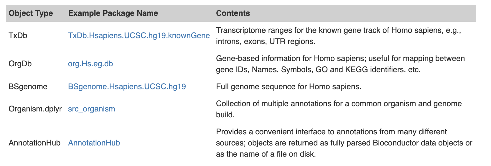

# Annotation
Bioconductor annotation resources have traditionally been used near the end of an analysis. After the bulk of the data analysis, annotations would be used interpretatively to learn about the most significant results. But increasingly, they are also used as a starting point or even as an intermediate step to help guide a study that is still in progress. 

Another change that is underway with annotations in Bioconductor is in the way that they are obtained. In the past annotations existed almost exclusively as separate annotation packages. Today packages are still an enormous source of annotations. The current release repository contains over eight hundred annotation packages. This table summarizes some of the more important classes of annotation objects that are often accessed using packages:

But in spite of the popularity of annotation packages, annotations are increasingly also being pulled down from web services like biomaRt or from the AnnotationHub. And both of these represent enormous resources for annotation data.





```r
  if (!"BiocManager" %in% rownames(installed.packages()))
       install.packages("BiocManager")
  BiocManager::install(c("AnnotationHub", "Homo.sapiens",
             "Organism.dplyr",
             "TxDb.Hsapiens.UCSC.hg19.knownGene",
             "TxDb.Hsapiens.UCSC.hg38.knownGene",
             "BSgenome.Hsapiens.UCSC.hg19", "biomaRt",
             "TxDb.Athaliana.BioMart.plantsmart22", "VariantAnnotation"))
```


```r
library(AnnotationHub)
```

```
## Loading required package: BiocGenerics
```

```
## Loading required package: parallel
```

```
## 
## Attaching package: 'BiocGenerics'
```

```
## The following objects are masked from 'package:parallel':
## 
##     clusterApply, clusterApplyLB, clusterCall, clusterEvalQ,
##     clusterExport, clusterMap, parApply, parCapply, parLapply,
##     parLapplyLB, parRapply, parSapply, parSapplyLB
```

```
## The following objects are masked from 'package:stats':
## 
##     IQR, mad, sd, var, xtabs
```

```
## The following objects are masked from 'package:base':
## 
##     anyDuplicated, append, as.data.frame, basename, cbind, colnames,
##     dirname, do.call, duplicated, eval, evalq, Filter, Find, get, grep,
##     grepl, intersect, is.unsorted, lapply, Map, mapply, match, mget,
##     order, paste, pmax, pmax.int, pmin, pmin.int, Position, rank,
##     rbind, Reduce, rownames, sapply, setdiff, sort, table, tapply,
##     union, unique, unsplit, which, which.max, which.min
```

```
## Loading required package: BiocFileCache
```

```
## Loading required package: dbplyr
```

```r
library(Homo.sapiens)
```

```
## Loading required package: AnnotationDbi
```

```
## Loading required package: stats4
```

```
## Loading required package: Biobase
```

```
## Welcome to Bioconductor
## 
##     Vignettes contain introductory material; view with
##     'browseVignettes()'. To cite Bioconductor, see
##     'citation("Biobase")', and for packages 'citation("pkgname")'.
```

```
## 
## Attaching package: 'Biobase'
```

```
## The following object is masked from 'package:AnnotationHub':
## 
##     cache
```

```
## Loading required package: IRanges
```

```
## Loading required package: S4Vectors
```

```
## 
## Attaching package: 'S4Vectors'
```

```
## The following object is masked from 'package:base':
## 
##     expand.grid
```

```
## 
## Attaching package: 'IRanges'
```

```
## The following object is masked from 'package:grDevices':
## 
##     windows
```

```
## Loading required package: OrganismDbi
```

```
## Loading required package: GenomicFeatures
```

```
## Loading required package: GenomeInfoDb
```

```
## Loading required package: GenomicRanges
```

```
## Loading required package: GO.db
```

```
## 
```

```
## Loading required package: org.Hs.eg.db
```

```
## 
```

```
## Loading required package: TxDb.Hsapiens.UCSC.hg19.knownGene
```

```r
library(Organism.dplyr)
```

```
## Loading required package: dplyr
```

```
## 
## Attaching package: 'dplyr'
```

```
## The following object is masked from 'package:OrganismDbi':
## 
##     select
```

```
## The following objects are masked from 'package:GenomicRanges':
## 
##     intersect, setdiff, union
```

```
## The following object is masked from 'package:GenomeInfoDb':
## 
##     intersect
```

```
## The following object is masked from 'package:AnnotationDbi':
## 
##     select
```

```
## The following objects are masked from 'package:IRanges':
## 
##     collapse, desc, intersect, setdiff, slice, union
```

```
## The following objects are masked from 'package:S4Vectors':
## 
##     first, intersect, rename, setdiff, setequal, union
```

```
## The following object is masked from 'package:Biobase':
## 
##     combine
```

```
## The following objects are masked from 'package:dbplyr':
## 
##     ident, sql
```

```
## The following objects are masked from 'package:BiocGenerics':
## 
##     combine, intersect, setdiff, union
```

```
## The following objects are masked from 'package:stats':
## 
##     filter, lag
```

```
## The following objects are masked from 'package:base':
## 
##     intersect, setdiff, setequal, union
```

```
## Loading required package: AnnotationFilter
```

```r
library(TxDb.Hsapiens.UCSC.hg19.knownGene)
library(TxDb.Hsapiens.UCSC.hg38.knownGene)
library(BSgenome.Hsapiens.UCSC.hg19)
```

```
## Loading required package: BSgenome
```

```
## Loading required package: Biostrings
```

```
## Loading required package: XVector
```

```
## 
## Attaching package: 'Biostrings'
```

```
## The following object is masked from 'package:base':
## 
##     strsplit
```

```
## Loading required package: rtracklayer
```

```r
library(biomaRt)
library(TxDb.Athaliana.BioMart.plantsmart22)
library(VariantAnnotation)
```

```
## Loading required package: SummarizedExperiment
```

```
## Loading required package: DelayedArray
```

```
## Loading required package: matrixStats
```

```
## 
## Attaching package: 'matrixStats'
```

```
## The following object is masked from 'package:dplyr':
## 
##     count
```

```
## The following objects are masked from 'package:Biobase':
## 
##     anyMissing, rowMedians
```

```
## Loading required package: BiocParallel
```

```
## 
## Attaching package: 'DelayedArray'
```

```
## The following objects are masked from 'package:matrixStats':
## 
##     colMaxs, colMins, colRanges, rowMaxs, rowMins, rowRanges
```

```
## The following objects are masked from 'package:base':
## 
##     aperm, apply, rowsum
```

```
## Loading required package: Rsamtools
```

```
## 
## Attaching package: 'VariantAnnotation'
```

```
## The following object is masked from 'package:base':
## 
##     tabulate
```


# AnnotationHub
The very 1st time that you call the AnnotationHub, it will create a cache directory on your system and download the latest metadata for the hubs current contents. From that time forward, whenever you download one of the hubs data objects, it will also cache those files in the local directory so that if you request the information again, you will be able to access it quickly.


```r
ah <- AnnotationHub()
```

```
## snapshotDate(): 2019-10-29
```


The show method of an AnnotationHub object will tell you how many resources are currently accessible using that object as well as give a high level overview of the most common kinds of data present.


```r
ah
```

```
## AnnotationHub with 48092 records
## # snapshotDate(): 2019-10-29 
## # $dataprovider: BroadInstitute, Ensembl, UCSC, ftp://ftp.ncbi.nlm.nih.gov/g...
## # $species: Homo sapiens, Mus musculus, Drosophila melanogaster, Bos taurus,...
## # $rdataclass: GRanges, BigWigFile, TwoBitFile, Rle, OrgDb, EnsDb, ChainFile...
## # additional mcols(): taxonomyid, genome, description,
## #   coordinate_1_based, maintainer, rdatadateadded, preparerclass, tags,
## #   rdatapath, sourceurl, sourcetype 
## # retrieve records with, e.g., 'object[["AH5012"]]' 
## 
##             title                                                              
##   AH5012  | Chromosome Band                                                    
##   AH5013  | STS Markers                                                        
##   AH5014  | FISH Clones                                                        
##   AH5015  | Recomb Rate                                                        
##   AH5016  | ENCODE Pilot                                                       
##   ...       ...                                                                
##   AH79558 | Xiphophorus_maculatus.X_maculatus-5.0-male.99.abinitio.gtf         
##   AH79559 | Xiphophorus_maculatus.X_maculatus-5.0-male.99.chr.gtf              
##   AH79560 | Xiphophorus_maculatus.X_maculatus-5.0-male.99.gtf                  
##   AH79561 | Zonotrichia_albicollis.Zonotrichia_albicollis-1.0.1.99.abinitio.gtf
##   AH79562 | Zonotrichia_albicollis.Zonotrichia_albicollis-1.0.1.99.gtf
```

As you can see from the object above, there are a LOT of different resources available. So normally when you get an AnnotationHub object the 1st thing you want to do is to filter it to remove unwanted resources.

Fortunately, the AnnotationHub has several different kinds of metadata that you can use for searching and subsetting. To see the different categories all you need to do is to type the name of your AnnotationHub object and then tab complete from the ‘$’ operator. And to see all possible contents of one of these categories you can pass that value in to unique like this:


```r
unique(ah$dataprovider)
```

```
##  [1] "UCSC"                                 
##  [2] "Ensembl"                              
##  [3] "RefNet"                               
##  [4] "Inparanoid8"                          
##  [5] "NHLBI"                                
##  [6] "ChEA"                                 
##  [7] "Pazar"                                
##  [8] "NIH Pathway Interaction Database"     
##  [9] "Haemcode"                             
## [10] "BroadInstitute"                       
## [11] "PRIDE"                                
## [12] "Gencode"                              
## [13] "CRIBI"                                
## [14] "Genoscope"                            
## [15] "MISO, VAST-TOOLS, UCSC"               
## [16] "UWashington"                          
## [17] "Stanford"                             
## [18] "dbSNP"                                
## [19] "BioMart"                              
## [20] "GeneOntology"                         
## [21] "KEGG"                                 
## [22] "URGI"                                 
## [23] "EMBL-EBI"                             
## [24] "MicrosporidiaDB"                      
## [25] "FungiDB"                              
## [26] "TriTrypDB"                            
## [27] "ToxoDB"                               
## [28] "AmoebaDB"                             
## [29] "PlasmoDB"                             
## [30] "PiroplasmaDB"                         
## [31] "CryptoDB"                             
## [32] "TrichDB"                              
## [33] "GiardiaDB"                            
## [34] "The Gene Ontology Consortium"         
## [35] "ENCODE Project"                       
## [36] "SchistoDB"                            
## [37] "NCBI/UniProt"                         
## [38] "GENCODE"                              
## [39] "http://www.pantherdb.org"             
## [40] "ftp://ftp.ncbi.nlm.nih.gov/gene/DATA/"
```

One of the most valuable ways in which the data is labeled is according to the kind of R object that will be returned to you.

```r
unique(ah$rdataclass)
```

```
##  [1] "GRanges"                           "data.frame"                       
##  [3] "Inparanoid8Db"                     "TwoBitFile"                       
##  [5] "ChainFile"                         "SQLiteConnection"                 
##  [7] "biopax"                            "BigWigFile"                       
##  [9] "AAStringSet"                       "MSnSet"                           
## [11] "mzRpwiz"                           "mzRident"                         
## [13] "list"                              "TxDb"                             
## [15] "Rle"                               "EnsDb"                            
## [17] "VcfFile"                           "igraph"                           
## [19] "data.frame, DNAStringSet, GRanges" "sqlite"                           
## [21] "data.table"                        "character"                        
## [23] "SQLite"                            "OrgDb"
```


Once you have identified which sorts of metadata you would like to use to find your data of interest, you can then use the subset or query methods to reduce the size of the hub object to something more manageable. For example you could select only those records where the string ‘GRanges’ was in the metadata. As you can see GRanges are one of the more popular formats for data that comes from the AnnotationHub.


```r
grs <- query(ah, "GRanges")
grs
```

```
## AnnotationHub with 22868 records
## # snapshotDate(): 2019-10-29 
## # $dataprovider: BroadInstitute, UCSC, Ensembl, Haemcode, FungiDB, Pazar, Tr...
## # $species: Homo sapiens, Mus musculus, Bos taurus, Pan troglodytes, Danio r...
## # $rdataclass: GRanges, data.frame, DNAStringSet, GRanges
## # additional mcols(): taxonomyid, genome, description,
## #   coordinate_1_based, maintainer, rdatadateadded, preparerclass, tags,
## #   rdatapath, sourceurl, sourcetype 
## # retrieve records with, e.g., 'object[["AH5012"]]' 
## 
##             title                                                              
##   AH5012  | Chromosome Band                                                    
##   AH5013  | STS Markers                                                        
##   AH5014  | FISH Clones                                                        
##   AH5015  | Recomb Rate                                                        
##   AH5016  | ENCODE Pilot                                                       
##   ...       ...                                                                
##   AH79558 | Xiphophorus_maculatus.X_maculatus-5.0-male.99.abinitio.gtf         
##   AH79559 | Xiphophorus_maculatus.X_maculatus-5.0-male.99.chr.gtf              
##   AH79560 | Xiphophorus_maculatus.X_maculatus-5.0-male.99.gtf                  
##   AH79561 | Zonotrichia_albicollis.Zonotrichia_albicollis-1.0.1.99.abinitio.gtf
##   AH79562 | Zonotrichia_albicollis.Zonotrichia_albicollis-1.0.1.99.gtf
```

```r
grs <- ah[ah$rdataclass == "GRanges",]
grs
```

```
## AnnotationHub with 22865 records
## # snapshotDate(): 2019-10-29 
## # $dataprovider: BroadInstitute, UCSC, Ensembl, Haemcode, FungiDB, Pazar, Tr...
## # $species: Homo sapiens, Mus musculus, Bos taurus, Pan troglodytes, Danio r...
## # $rdataclass: GRanges
## # additional mcols(): taxonomyid, genome, description,
## #   coordinate_1_based, maintainer, rdatadateadded, preparerclass, tags,
## #   rdatapath, sourceurl, sourcetype 
## # retrieve records with, e.g., 'object[["AH5012"]]' 
## 
##             title                                                              
##   AH5012  | Chromosome Band                                                    
##   AH5013  | STS Markers                                                        
##   AH5014  | FISH Clones                                                        
##   AH5015  | Recomb Rate                                                        
##   AH5016  | ENCODE Pilot                                                       
##   ...       ...                                                                
##   AH79558 | Xiphophorus_maculatus.X_maculatus-5.0-male.99.abinitio.gtf         
##   AH79559 | Xiphophorus_maculatus.X_maculatus-5.0-male.99.chr.gtf              
##   AH79560 | Xiphophorus_maculatus.X_maculatus-5.0-male.99.gtf                  
##   AH79561 | Zonotrichia_albicollis.Zonotrichia_albicollis-1.0.1.99.abinitio.gtf
##   AH79562 | Zonotrichia_albicollis.Zonotrichia_albicollis-1.0.1.99.gtf
```

```r
orgs <- subset(ah, ah$rdataclass == "OrgDb")
orgs
```

```
## AnnotationHub with 1708 records
## # snapshotDate(): 2019-10-29 
## # $dataprovider: ftp://ftp.ncbi.nlm.nih.gov/gene/DATA/
## # $species: Escherichia coli, [Nectria] haematococca_mpVI_77-13-4, Zymosepto...
## # $rdataclass: OrgDb
## # additional mcols(): taxonomyid, genome, description,
## #   coordinate_1_based, maintainer, rdatadateadded, preparerclass, tags,
## #   rdatapath, sourceurl, sourcetype 
## # retrieve records with, e.g., 'object[["AH75733"]]' 
## 
##             title                                    
##   AH75733 | org.Ag.eg.db.sqlite                      
##   AH75734 | org.At.tair.db.sqlite                    
##   AH75735 | org.Bt.eg.db.sqlite                      
##   AH75736 | org.Cf.eg.db.sqlite                      
##   AH75737 | org.Gg.eg.db.sqlite                      
##   ...       ...                                      
##   AH77453 | org.Mycobacterium_giae.eg.sqlite         
##   AH77454 | org.Mycobacterium_minetti.eg.sqlite      
##   AH77455 | org.Mycolicibacterium_fortuitum.eg.sqlite
##   AH77456 | org.Plasmodium_gonderi.eg.sqlite         
##   AH77457 | org.Paenibacillus_odorifer.eg.sqlite
```

And if you really need access to all the metadata you can extract it as a DataFrame using mcols() like so:

```r
meta <- mcols(ah)
```
Also if you are a fan of GUI’s you can use the display method to look at your data in a browser and return selected rows back as a smaller AnnotationHub object like this:


```r
#sah <- display(ah)
```

Calling this method will produce a web based interface. 

Once you have the AnnotationHub object pared down to a reasonable size, and are sure about which records you want to retrieve, then you only need to use the ‘[[’ operator to extract them. Using the ‘[[’ operator, you can extract by numeric index (1,2,3) or by AnnotationHub ID. If you choose to use the former, you simply extract the element that you are interested in. So for our chain example, you might just want to 1st one like this:


```r
res <- grs[[1]]
## loading from cache
```


```r
head(res, n=3)
```

```
## UCSC track 'cytoBand'
## UCSCData object with 3 ranges and 1 metadata column:
##       seqnames          ranges strand |        name
##          <Rle>       <IRanges>  <Rle> | <character>
##   [1]     chr1       1-2300000      * |      p36.33
##   [2]     chr1 2300001-5400000      * |      p36.32
##   [3]     chr1 5400001-7200000      * |      p36.31
##   -------
##   seqinfo: 93 sequences (1 circular) from hg19 genome
```


# OrgDb objects

OrgDb objects are one member of a family of annotation objects that all represent hidden data through a shared set of methods. So if you look closely at the dog object created below you can see it contains data for Canis familiaris (taxonomy ID = 9615). You can learn a little more about it by learning about the columns method.


```r
dog <- query(orgs, "Canis familiaris")[[1]]
```

```
## downloading 1 resources
```

```
## retrieving 1 resource
```

```
## loading from cache
```

```r
dog
```

```
## OrgDb object:
## | DBSCHEMAVERSION: 2.1
## | Db type: OrgDb
## | Supporting package: AnnotationDbi
## | DBSCHEMA: CANINE_DB
## | ORGANISM: Canis familiaris
## | SPECIES: Canine
## | EGSOURCEDATE: 2019-Jul10
## | EGSOURCENAME: Entrez Gene
## | EGSOURCEURL: ftp://ftp.ncbi.nlm.nih.gov/gene/DATA
## | CENTRALID: EG
## | TAXID: 9615
## | GOSOURCENAME: Gene Ontology
## | GOSOURCEURL: ftp://ftp.geneontology.org/pub/go/godatabase/archive/latest-lite/
## | GOSOURCEDATE: 2019-Jul10
## | GOEGSOURCEDATE: 2019-Jul10
## | GOEGSOURCENAME: Entrez Gene
## | GOEGSOURCEURL: ftp://ftp.ncbi.nlm.nih.gov/gene/DATA
## | KEGGSOURCENAME: KEGG GENOME
## | KEGGSOURCEURL: ftp://ftp.genome.jp/pub/kegg/genomes
## | KEGGSOURCEDATE: 2011-Mar15
## | GPSOURCENAME: UCSC Genome Bioinformatics (Canis familiaris)
## | GPSOURCEURL: 
## | GPSOURCEDATE: 2017-Apr6
## | UNIPROTGOSOURCENAME: UNIPROTGO
## | UNIPROTGOSOURCEDATE: Tue Sep 24 12:17:50 2019
## | UNIPROTGOSOURCEURL: ftp://ftp.uniprot.org/pub/databases/uniprot/current_release/knowledgebase/idmapping/idmapping_selected.tab.gz
## | ENSOURCEDATE: 2019-Jun24
## | ENSOURCENAME: Ensembl
## | ENSOURCEURL: ftp://ftp.ensembl.org/pub/current_fasta
```

```
## 
## Please see: help('select') for usage information
```

The columns method gives you a vector of data types that can be retrieved from the object that you call it on. So the above call indicates that there are several different data types that can be retrieved from the tetra object.

A very similar method is the keytypes method, which will list all the data types that can also be used as keys.

```r
columns(dog)
```

```
##  [1] "ACCNUM"       "ALIAS"        "ENSEMBL"      "ENSEMBLPROT"  "ENSEMBLTRANS"
##  [6] "ENTREZID"     "ENZYME"       "EVIDENCE"     "EVIDENCEALL"  "GENENAME"    
## [11] "GO"           "GOALL"        "ONTOLOGY"     "ONTOLOGYALL"  "PATH"        
## [16] "PMID"         "REFSEQ"       "SYMBOL"       "UNIGENE"      "UNIPROT"
```

```r
keytypes(dog)
```

```
##  [1] "ACCNUM"       "ALIAS"        "ENSEMBL"      "ENSEMBLPROT"  "ENSEMBLTRANS"
##  [6] "ENTREZID"     "ENZYME"       "EVIDENCE"     "EVIDENCEALL"  "GENENAME"    
## [11] "GO"           "GOALL"        "ONTOLOGY"     "ONTOLOGYALL"  "PATH"        
## [16] "PMID"         "REFSEQ"       "SYMBOL"       "UNIGENE"      "UNIPROT"
```

Now that you can see what kinds of things can be used as keys, you can call the keys method to extract out all the keys of a given key type.

```r
head(keys(dog, keytype="ENTREZID"))
```

```
## [1] "399518" "399530" "399544" "399545" "399653" "403152"
```
For example, using the keys method you could also extract the gene SYMBOLS that contain “COX”:

```r
keys(dog, keytype="SYMBOL", pattern="COX")
```

```
##  [1] "COX5B"   "COX7A2L" "COX8A"   "COX15"   "COX5A"   "COX4I1"  "COX6A2" 
##  [8] "COX20"   "COX18"   "ACOX1"   "COX4I2"  "ACOX3"   "COX10"   "COX17"  
## [15] "COX11"   "ACOXL"   "COX7A1"  "COX1"    "COX2"    "COX3"    "COX19"  
## [22] "COX7B2"  "COX14"   "COX16"   "ACOX2"
```
Or if you really needed an other keytype, you can use the column argument to extract the ENTREZ GENE IDs for those gene SYMBOLS that contain the string “COX”:


```r
keys(dog, keytype="ENTREZID", pattern="COX", column="SYMBOL")
```

```
## 'select()' returned 1:1 mapping between keys and columns
```

```
##  [1] "474567"    "475739"    "476040"    "477792"    "478370"    "479623"   
##  [7] "479780"    "480099"    "482193"    "483322"    "485825"    "488790"   
## [13] "489515"    "503668"    "609555"    "611729"    "612614"    "804478"   
## [19] "804479"    "804480"    "100685945" "100687434" "100688544" "100846976"
## [25] "100855488"
```

But often, you will really want to extract other data that matches a particular key or set of keys. For that there are two methods which you can use. The more powerful of these is probably select. Here is how you would look up the gene SYMBOL, and REFSEQ id for specific entrez gene ID.

```r
select(dog, keys="804478", columns=c("SYMBOL","REFSEQ"), keytype="ENTREZID")
```

```
## 'select()' returned 1:1 mapping between keys and columns
```

```
##   ENTREZID SYMBOL    REFSEQ
## 1   804478   COX1 NP_008473
```

When you call it, select will return a data.frame that attempts to fill in matching values for all the columns you requested. However, if you ask select for things that have a many to one relationship to your keys it can result in an expansion of the data object that is returned. For example, watch what happens when we ask for the GO terms for the same entrez gene ID:

```r
#The IEA evidence code is used for annotations that are computationally, or automatically, assigned to gene products without further manual, curator review. 
select(dog, keys="804478", columns="GO", keytype="ENTREZID")
```

```
## 'select()' returned 1:many mapping between keys and columns
```

```
##    ENTREZID         GO EVIDENCE ONTOLOGY
## 1    804478 GO:0004129      IEA       MF
## 2    804478 GO:0005750      IEA       CC
## 3    804478 GO:0005751      IEA       CC
## 4    804478 GO:0006119      IEA       BP
## 5    804478 GO:0006123      IEA       BP
## 6    804478 GO:0009060      IEA       BP
## 7    804478 GO:0015990      IEA       BP
## 8    804478 GO:0016021      IEA       CC
## 9    804478 GO:0020037      IEA       MF
## 10   804478 GO:0045277      IEA       CC
## 11   804478 GO:0046872      IEA       MF
```
Because there are several GO terms associated with the gene “804478”, you end up with many rows in the data.frame.
This can become problematic if you then ask for several columns that have a many to one relationship to the original key.
Sometimes you might want to look up matching results in a way that is simpler than the data.frame object that select returns. This is especially true when you only want to look up one kind of value per key. 


```r
mapIds(dog, keys="804478", column="GO", keytype="ENTREZID")
```

```
## 'select()' returned 1:many mapping between keys and columns
```

```
##       804478 
## "GO:0004129"
```

As you can see, the mapIds method allows you to simplify the result that is returned. And by default, mapIds only returns the 1st matching element for each key. But what if you really need all those GO terms returned when you call mapIds? Well then you can make use of the mapIds multiVals argument. There are several options for this argument, we have already seen how by default you can return only the ‘first’ element. 

```r
mapIds(dog, keys="804478", column="GO", keytype="ENTREZID", multiVals="list")
```

```
## 'select()' returned 1:many mapping between keys and columns
```

```
## $`804478`
##  [1] "GO:0004129" "GO:0005750" "GO:0005751" "GO:0006119" "GO:0006123"
##  [6] "GO:0009060" "GO:0015990" "GO:0016021" "GO:0020037" "GO:0045277"
## [11] "GO:0046872"
```

# TxDb Objects

As mentioned before, TxDb objects can be accessed using the standard set of methods: keytypes(), columns(), keys(), select(), and mapIds(). But because these objects contain information about a transcriptome, they are often used to compare range based information to these important features of the genome. As a result they also have specialized accessors for extracting out ranges that correspond to important transcriptome characteristics.

Lets start by loading a TxDb object from an annotation package based on the UCSC ensembl genes track for Drosophila. A common practice when loading these is to shorten the long name to ‘txdb’ (just as a convenience).


```r
txdb <- TxDb.Hsapiens.UCSC.hg19.knownGene
txdb
```

```
## TxDb object:
## # Db type: TxDb
## # Supporting package: GenomicFeatures
## # Data source: UCSC
## # Genome: hg19
## # Organism: Homo sapiens
## # Taxonomy ID: 9606
## # UCSC Table: knownGene
## # Resource URL: http://genome.ucsc.edu/
## # Type of Gene ID: Entrez Gene ID
## # Full dataset: yes
## # miRBase build ID: GRCh37
## # transcript_nrow: 82960
## # exon_nrow: 289969
## # cds_nrow: 237533
## # Db created by: GenomicFeatures package from Bioconductor
## # Creation time: 2015-10-07 18:11:28 +0000 (Wed, 07 Oct 2015)
## # GenomicFeatures version at creation time: 1.21.30
## # RSQLite version at creation time: 1.0.0
## # DBSCHEMAVERSION: 1.1
```

```r
#we can access to it also from ah object  subset(ah, ah$rdataclass == "TxDb") as we have done for OrgDb
```

Just by looking at the TxDb object, we can learn a lot about what data it contains including where the data came from, which build of the UCSC genome it was based on and the last time that the object was updated. One of the most common uses for a TxDb object is to extract various kinds of transcript data out of it. So for example you can extract all the transcripts out of the TxDb as a GRanges object like this:


```r
txs <- transcripts(txdb)
txs
```

```
## GRanges object with 82960 ranges and 2 metadata columns:
##                 seqnames        ranges strand |     tx_id     tx_name
##                    <Rle>     <IRanges>  <Rle> | <integer> <character>
##       [1]           chr1   11874-14409      + |         1  uc001aaa.3
##       [2]           chr1   11874-14409      + |         2  uc010nxq.1
##       [3]           chr1   11874-14409      + |         3  uc010nxr.1
##       [4]           chr1   69091-70008      + |         4  uc001aal.1
##       [5]           chr1 321084-321115      + |         5  uc001aaq.2
##       ...            ...           ...    ... .       ...         ...
##   [82956] chrUn_gl000237        1-2686      - |     82956  uc011mgu.1
##   [82957] chrUn_gl000241   20433-36875      - |     82957  uc011mgv.2
##   [82958] chrUn_gl000243   11501-11530      + |     82958  uc011mgw.1
##   [82959] chrUn_gl000243   13608-13637      + |     82959  uc022brq.1
##   [82960] chrUn_gl000247     5787-5816      - |     82960  uc022brr.1
##   -------
##   seqinfo: 93 sequences (1 circular) from hg19 genome
```

Similarly, there are also extractors for ***exons(), cds(), genes() and promoters()***. 


Which kind of feature you choose to extract just depends on what information you are after. These basic extractors are fine if you only want a flat representation of these data, but many of these features are inherently nested. So instead of extracting a flat GRanges object, you might choose instead to extract a GRangesList object that groups the transcripts by the genes that they are associated with like this:


```r
txby <- transcriptsBy(txdb, by="gene")
txby
```

```
## GRangesList object of length 23459:
## $`1`
## GRanges object with 2 ranges and 2 metadata columns:
##       seqnames            ranges strand |     tx_id     tx_name
##          <Rle>         <IRanges>  <Rle> | <integer> <character>
##   [1]    chr19 58858172-58864865      - |     70455  uc002qsd.4
##   [2]    chr19 58859832-58874214      - |     70456  uc002qsf.2
##   -------
##   seqinfo: 93 sequences (1 circular) from hg19 genome
## 
## $`10`
## GRanges object with 1 range and 2 metadata columns:
##       seqnames            ranges strand |     tx_id     tx_name
##          <Rle>         <IRanges>  <Rle> | <integer> <character>
##   [1]     chr8 18248755-18258723      + |     31944  uc003wyw.1
##   -------
##   seqinfo: 93 sequences (1 circular) from hg19 genome
## 
## $`100`
## GRanges object with 1 range and 2 metadata columns:
##       seqnames            ranges strand |     tx_id     tx_name
##          <Rle>         <IRanges>  <Rle> | <integer> <character>
##   [1]    chr20 43248163-43280376      - |     72132  uc002xmj.3
##   -------
##   seqinfo: 93 sequences (1 circular) from hg19 genome
## 
## ...
## <23456 more elements>
```

Just as with the flat extractors, there is a whole family of extractors available depending on what you want to extract and how you want it grouped. They include ***transcriptsBy(), exonsBy(), cdsBy(), intronsByTranscript(), fiveUTRsByTranscript() and threeUTRsByTranscript()***.

When dealing with genomic data it is almost inevitable that you will run into problems with the way that different groups have adopted alternate ways of naming chromosomes. This is because almost every major repository has cooked up their own slightly different way of labeling these important features.

To cope with this, the Seqinfo object was invented and is attached to TxDb objects as well as the GenomicRanges extracted from these objects. You can extract it using the seqinfo() method like this:


```r
si <- seqinfo(txdb)
si
```

```
## Seqinfo object with 93 sequences (1 circular) from hg19 genome:
##   seqnames       seqlengths isCircular genome
##   chr1            249250621       <NA>   hg19
##   chr2            243199373       <NA>   hg19
##   chr3            198022430       <NA>   hg19
##   chr4            191154276       <NA>   hg19
##   chr5            180915260       <NA>   hg19
##   ...                   ...        ...    ...
##   chrUn_gl000245      36651       <NA>   hg19
##   chrUn_gl000246      38154       <NA>   hg19
##   chrUn_gl000247      36422       <NA>   hg19
##   chrUn_gl000248      39786       <NA>   hg19
##   chrUn_gl000249      38502       <NA>   hg19
```

And since the seqinfo information is also attached to the GRanges objects produced by the TxDb extractors, you can also call seqinfo on the results of those methods like this:


```r
txby <- transcriptsBy(txdb, by="gene")
si <- seqinfo(txby)
```
Sometimes you may have a situation where your annotation object contains data that is comparable to your data object, but where it is simply named with a different naming style. For those cases, there are helpers that you can use to discover what the current name style is for an object. And there is also a setter method to allow you to change the value to something more appropriate. So in the following example, we are going to change the seqlevelStyle from ‘UCSC’ to ‘ensembl’ based naming convention (and then back again).


```r
head(seqlevels(txdb))
```

```
## [1] "chr1" "chr2" "chr3" "chr4" "chr5" "chr6"
```

```r
seqlevelsStyle(txdb)
```

```
## [1] "UCSC"
```

```r
seqlevelsStyle(txdb) <- "NCBI"
head(seqlevels(txdb))
```

```
## [1] "1" "2" "3" "4" "5" "6"
```
Then change it back

```r
seqlevelsStyle(txdb) <- "UCSC"
head(seqlevels(txdb))
```

```
## [1] "chr1" "chr2" "chr3" "chr4" "chr5" "chr6"
```

In addition to being able to change the naming style used for an object with seqinfo data, you can also toggle which of the chromosomes are ‘active’ so that the software will ignore certain chromosomes. By default, all of the chromosomes are set to be ‘active’.


```r
head(isActiveSeq(txdb), n=30)
```

```
##                 chr1                 chr2                 chr3 
##                 TRUE                 TRUE                 TRUE 
##                 chr4                 chr5                 chr6 
##                 TRUE                 TRUE                 TRUE 
##                 chr7                 chr8                 chr9 
##                 TRUE                 TRUE                 TRUE 
##                chr10                chr11                chr12 
##                 TRUE                 TRUE                 TRUE 
##                chr13                chr14                chr15 
##                 TRUE                 TRUE                 TRUE 
##                chr16                chr17                chr18 
##                 TRUE                 TRUE                 TRUE 
##                chr19                chr20                chr21 
##                 TRUE                 TRUE                 TRUE 
##                chr22                 chrX                 chrY 
##                 TRUE                 TRUE                 TRUE 
##                 chrM chr1_gl000191_random chr1_gl000192_random 
##                 TRUE                 TRUE                 TRUE 
##       chr4_ctg9_hap1 chr4_gl000193_random chr4_gl000194_random 
##                 TRUE                 TRUE                 TRUE
```
But sometimes you might wish to ignore some of them. For example, lets suppose that you wanted to ignore the Y chromosome from our txdb. You could do that like so:


```r
isActiveSeq(txdb)["chrY"] <- FALSE
```


# Organism.dplyr

So what happens if you have data from multiple different Annotation objects. For example, what if you had gene SYMBOLS (found in an OrgDb object) and you wanted to easily match those up with known gene transcript names from a UCSC based TxDb object? There is an ideal tool that can help with this kind of problem and it’s called an src_organism object from the Organism.dplyr package. src_organism objects and their related methods are able to query each of OrgDb and TxDb resources for you and then merge the results back together in way that lets you pretend that you only have one source for all your annotations.


src_organism objects can be created for organisms that have both an OrgDb and a TxDb. To see organisms that can have src_organism objects made, use the function supportOrganisms():


```r
supported <- supportedOrganisms()
print(supported, n=Inf)
```

```
## # A tibble: 21 x 3
##    organism                OrgDb         TxDb                                  
##    <chr>                   <chr>         <chr>                                 
##  1 Bos taurus              org.Bt.eg.db  TxDb.Btaurus.UCSC.bosTau8.refGene     
##  2 Caenorhabditis elegans  org.Ce.eg.db  TxDb.Celegans.UCSC.ce11.refGene       
##  3 Caenorhabditis elegans  org.Ce.eg.db  TxDb.Celegans.UCSC.ce6.ensGene        
##  4 Canis familiaris        org.Cf.eg.db  TxDb.Cfamiliaris.UCSC.canFam3.refGene 
##  5 Drosophila melanogaster org.Dm.eg.db  TxDb.Dmelanogaster.UCSC.dm3.ensGene   
##  6 Drosophila melanogaster org.Dm.eg.db  TxDb.Dmelanogaster.UCSC.dm6.ensGene   
##  7 Danio rerio             org.Dr.eg.db  TxDb.Drerio.UCSC.danRer10.refGene     
##  8 Gallus gallus           org.Gg.eg.db  TxDb.Ggallus.UCSC.galGal4.refGene     
##  9 Homo sapiens            org.Hs.eg.db  TxDb.Hsapiens.UCSC.hg18.knownGene     
## 10 Homo sapiens            org.Hs.eg.db  TxDb.Hsapiens.UCSC.hg19.knownGene     
## 11 Homo sapiens            org.Hs.eg.db  TxDb.Hsapiens.UCSC.hg38.knownGene     
## 12 Mus musculus            org.Mm.eg.db  TxDb.Mmusculus.UCSC.mm10.ensGene      
## 13 Mus musculus            org.Mm.eg.db  TxDb.Mmusculus.UCSC.mm10.knownGene    
## 14 Mus musculus            org.Mm.eg.db  TxDb.Mmusculus.UCSC.mm9.knownGene     
## 15 Macaca mulatta          org.Mmu.eg.db TxDb.Mmulatta.UCSC.rheMac3.refGene    
## 16 Macaca mulatta          org.Mmu.eg.db TxDb.Mmulatta.UCSC.rheMac8.refGene    
## 17 Pan troglodytes         org.Pt.eg.db  TxDb.Ptroglodytes.UCSC.panTro4.refGene
## 18 Rattus norvegicus       org.Rn.eg.db  TxDb.Rnorvegicus.UCSC.rn4.ensGene     
## 19 Rattus norvegicus       org.Rn.eg.db  TxDb.Rnorvegicus.UCSC.rn5.refGene     
## 20 Rattus norvegicus       org.Rn.eg.db  TxDb.Rnorvegicus.UCSC.rn6.refGene     
## 21 Sus scrofa              org.Ss.eg.db  TxDb.Sscrofa.UCSC.susScr3.refGene
```
Notice how there are multiple entries for a single organism (e.g. three for Homo sapiens). There is only one OrgDb per organism, but different TxDbs can be used. To specify a certain version of a TxDb to use, we can use the src_organism() function to create an src_organism object.


```r
library(org.Hs.eg.db)
library(TxDb.Hsapiens.UCSC.hg38.knownGene)
```


```r
src <- src_organism("TxDb.Hsapiens.UCSC.hg38.knownGene")
```

We can also create one using the src_ucsc() function. This will create an src_organism object using the most recent TxDb version available:

```r
src <- src_ucsc("Homo sapiens")
src
```


The five methods that worked for all of the other Db objects that we have discussed (keytypes(), columns(), keys(), select(), and mapIds()) all work for src_organism objects. Here, we use keytypes() to show which keytypes can be passed to the keytype argument of select().

```r
keytypes(src)
```

```
##  [1] "accnum"       "alias"        "cds_chrom"    "cds_end"      "cds_id"      
##  [6] "cds_name"     "cds_start"    "cds_strand"   "ensembl"      "ensemblprot" 
## [11] "ensembltrans" "entrez"       "enzyme"       "evidence"     "evidenceall" 
## [16] "exon_chrom"   "exon_end"     "exon_id"      "exon_name"    "exon_rank"   
## [21] "exon_start"   "exon_strand"  "gene_chrom"   "gene_end"     "gene_start"  
## [26] "gene_strand"  "genename"     "go"           "goall"        "ipi"         
## [31] "map"          "omim"         "ontology"     "ontologyall"  "pfam"        
## [36] "pmid"         "prosite"      "refseq"       "symbol"       "tx_chrom"    
## [41] "tx_end"       "tx_id"        "tx_name"      "tx_start"     "tx_strand"   
## [46] "tx_type"      "unigene"      "uniprot"
```

```r
columns(src)
```

```
##  [1] "accnum"       "alias"        "cds_chrom"    "cds_end"      "cds_id"      
##  [6] "cds_name"     "cds_start"    "cds_strand"   "ensembl"      "ensemblprot" 
## [11] "ensembltrans" "entrez"       "enzyme"       "evidence"     "evidenceall" 
## [16] "exon_chrom"   "exon_end"     "exon_id"      "exon_name"    "exon_rank"   
## [21] "exon_start"   "exon_strand"  "gene_chrom"   "gene_end"     "gene_start"  
## [26] "gene_strand"  "genename"     "go"           "goall"        "ipi"         
## [31] "map"          "omim"         "ontology"     "ontologyall"  "pfam"        
## [36] "pmid"         "prosite"      "refseq"       "symbol"       "tx_chrom"    
## [41] "tx_end"       "tx_id"        "tx_name"      "tx_start"     "tx_strand"   
## [46] "tx_type"      "unigene"      "uniprot"
```
You can now use these objects in the same way that you use OrgDb or TxDb objects. It works the same as the base objects that it contains:

```r
select(src, keys="4488", columns=c("symbol", "tx_name"), keytype="entrez")
```

```
## Joining, by = "entrez"
```

```
##   entrez symbol           tx_name
## 1   4488   MSX2 ENST00000239243.7
## 2   4488   MSX2 ENST00000507785.2
```

Organism.dplyr also supports numerous Genomic Extractor functions allowing users to filter based on information contained in the OrgDb and TxDb objects. To see the filters supported by a src_organism() object, use supportedFIlters():


```r
head(supportedFilters(src))
```

```
##            filter     field
## 1    AccnumFilter    accnum
## 2     AliasFilter     alias
## 3  CdsChromFilter cds_chrom
## 45   CdsEndFilter   cds_end
## 43    CdsIdFilter    cds_id
## 4   CdsNameFilter  cds_name
```
Here we declare a GRangesFilter and use two different type-returning accessors to query transcripts that either start with “SNORD” and are within our given GRangesFilter, or have symbol with symbol “ADA”:

```r
gr <- GRangesFilter(GenomicRanges::GRanges("chr1:44000000-55000000"))
transcripts(src, filter=~(symbol %startsWith% "SNORD" & gr) | symbol == "ADA")
```

```
## GRanges object with 14 ranges and 3 metadata columns:
##        seqnames            ranges strand |     tx_id           tx_name
##           <Rle>         <IRanges>  <Rle> | <integer>       <character>
##    [1]     chr1 44775864-44775943      + |      3082 ENST00000581525.1
##    [2]     chr1 44776490-44776593      + |      3083 ENST00000364043.1
##    [3]     chr1 44777843-44777912      + |      3086 ENST00000365161.1
##    [4]     chr1 44778390-44778456      + |      3088 ENST00000384690.1
##    [5]     chr1 44778390-44778458      + |      3089 ENST00000625943.1
##    ...      ...               ...    ... .       ...               ...
##   [10]    chr20 44619810-44651691      - |    210823 ENST00000537820.1
##   [11]    chr20 44619810-44651691      - |    210824 ENST00000539235.5
##   [12]    chr20 44626323-44651661      - |    210825 ENST00000545776.5
##   [13]    chr20 44626517-44652114      - |    210826 ENST00000536076.1
##   [14]    chr20 44636071-44652233      - |    210827 ENST00000535573.1
##             symbol
##        <character>
##    [1]     SNORD55
##    [2]     SNORD46
##    [3]    SNORD38A
##    [4]    SNORD38B
##    [5]    SNORD38B
##    ...         ...
##   [10]         ADA
##   [11]         ADA
##   [12]         ADA
##   [13]         ADA
##   [14]         ADA
##   -------
##   seqinfo: 595 sequences (1 circular) from hg38 genome
```

# BSgenome Objects
Another important annotation resource type is a BSgenome package. There are many BSgenome packages in the repository for you to choose from. And you can learn which organisms are already supported by using the available.genomes() function.

```r
head(available.genomes())
```

```
## [1] "BSgenome.Alyrata.JGI.v1"                
## [2] "BSgenome.Amellifera.BeeBase.assembly4"  
## [3] "BSgenome.Amellifera.UCSC.apiMel2"       
## [4] "BSgenome.Amellifera.UCSC.apiMel2.masked"
## [5] "BSgenome.Aofficinalis.NCBI.V1"          
## [6] "BSgenome.Athaliana.TAIR.04232008"
```
Unlike the other resources that we have discussed here, these packages are meant to contain sequence data for a specific genome build of an organism. You can load one of these packages in the usual way. And each of them normally has an alias for the primary object that is shorter than the full package name (as a convenience):

```r
Hsapiens
```

```
## Human genome:
## # organism: Homo sapiens (Human)
## # provider: UCSC
## # provider version: hg19
## # release date: Feb. 2009
## # release name: Genome Reference Consortium GRCh37
## # 93 sequences:
## #   chr1                  chr2                  chr3                 
## #   chr4                  chr5                  chr6                 
## #   chr7                  chr8                  chr9                 
## #   chr10                 chr11                 chr12                
## #   chr13                 chr14                 chr15                
## #   ...                   ...                   ...                  
## #   chrUn_gl000235        chrUn_gl000236        chrUn_gl000237       
## #   chrUn_gl000238        chrUn_gl000239        chrUn_gl000240       
## #   chrUn_gl000241        chrUn_gl000242        chrUn_gl000243       
## #   chrUn_gl000244        chrUn_gl000245        chrUn_gl000246       
## #   chrUn_gl000247        chrUn_gl000248        chrUn_gl000249       
## # (use 'seqnames()' to see all the sequence names, use the '$' or '[[' operator
## # to access a given sequence)
```

The getSeq method is a useful way of extracting data from these packages. This method takes several arguments but the important ones are the 1st two. The 1st argument specifies the BSgenome object to use and the second argument (names) specifies what data you want back out. So for example, if you call it and give a character vector that names the seqnames for the object then you will get the sequences from those chromosomes as a DNAStringSet object.


```r
seqNms <- seqnames(Hsapiens)
head(seqNms)
```

```
## [1] "chr1" "chr2" "chr3" "chr4" "chr5" "chr6"
```

```r
getSeq(Hsapiens, seqNms[1:2])
```

```
##   A DNAStringSet instance of length 2
##         width seq                                           names               
## [1] 249250621 NNNNNNNNNNNNNNNNNNNNN...NNNNNNNNNNNNNNNNNNNNN chr1
## [2] 243199373 NNNNNNNNNNNNNNNNNNNNN...NNNNNNNNNNNNNNNNNNNNN chr2
```

Whereas if you give the a GRanges object for the 2nd argument, you can instead get a DNAStringSet that corresponds to those ranges. This can be a powerful way to learn what sequence was present from a particular range. For example, here we can extract the range of a specific gene of interest like this.


```r
txby <- transcriptsBy(txdb, by="gene")
geneOfInterest <- txby[["4488"]]
res <- getSeq(Hsapiens, geneOfInterest)
res
```

```
##   A DNAStringSet instance of length 1
##     width seq
## [1]  6328 TCCCGTCTCCGCAGCAAAAAAGTTTGAGTCGCCG...TATTGCAGTAAAGTTTGTCCAAACTCACAATTA
```

# biomaRt
Another great annotation resource is the biomaRt package. The biomaRt package exposes a huge family of different online annotation resources called marts. Each mart is another of a set of online web resources that are following a convention that allows them to work with this package. So the first step in using biomaRt is always to load the package and then decide which “mart” you want to use. Once you have made your decision, you will then use the useMart() method to create a mart object in your R session. Here we are looking at the marts available and then choosing to use one of the most popular marts: the “ensembl”" mart.

```r
listMarts()
```

```
##                biomart                version
## 1 ENSEMBL_MART_ENSEMBL      Ensembl Genes 100
## 2   ENSEMBL_MART_MOUSE      Mouse strains 100
## 3     ENSEMBL_MART_SNP  Ensembl Variation 100
## 4 ENSEMBL_MART_FUNCGEN Ensembl Regulation 100
```

```r
ensembl <- useMart("ensembl")
ensembl
```

```
## Object of class 'Mart':
##   Using the ENSEMBL_MART_ENSEMBL BioMart database
##   No dataset selected.
```
Each ‘mart’ can contain datasets for multiple different things. So the next step is that you need to decide on a dataset. Once you have chosen one, you will need to specify that dataset using the dataset argument when you call the useMart() constructor method. Here we will point to the dataset for humans.


```r
head(listDatasets(ensembl))
```

```
##                      dataset                                  description
## 1   acalliptera_gene_ensembl             Eastern happy genes (fAstCal1.2)
## 2 acarolinensis_gene_ensembl               Anole lizard genes (AnoCar2.0)
## 3  acchrysaetos_gene_ensembl              Golden eagle genes (bAquChr1.2)
## 4  acitrinellus_gene_ensembl               Midas cichlid genes (Midas_v5)
## 5  amelanoleuca_gene_ensembl                        Panda genes (ailMel1)
## 6    amexicanus_gene_ensembl Mexican tetra genes (Astyanax_mexicanus-2.0)
##                  version
## 1             fAstCal1.2
## 2              AnoCar2.0
## 3             bAquChr1.2
## 4               Midas_v5
## 5                ailMel1
## 6 Astyanax_mexicanus-2.0
```

```r
ensembl <- useMart("ensembl",dataset="hsapiens_gene_ensembl")
ensembl
```

```
## Object of class 'Mart':
##   Using the ENSEMBL_MART_ENSEMBL BioMart database
##   Using the hsapiens_gene_ensembl dataset
```
Next we need to think about attributes, values and filters. Lets start with attributes. You can get a listing of the different kinds of attributes from biomaRt buy using the listAttributes method:

```r
head(listAttributes(ensembl))
```

```
##                            name                  description         page
## 1               ensembl_gene_id               Gene stable ID feature_page
## 2       ensembl_gene_id_version       Gene stable ID version feature_page
## 3         ensembl_transcript_id         Transcript stable ID feature_page
## 4 ensembl_transcript_id_version Transcript stable ID version feature_page
## 5            ensembl_peptide_id            Protein stable ID feature_page
## 6    ensembl_peptide_id_version    Protein stable ID version feature_page
```
And you can see what the values for a particular attribute are by using the getBM method:

```r
head(getBM(attributes="chromosome_name", mart=ensembl))
```

```
##   chromosome_name
## 1               1
## 2              10
## 3              11
## 4              12
## 5              13
## 6              14
```
Attributes are the things that you can have returned from biomaRt. They are analogous to what you get when you use the columns method with other objects.

In the biomaRt package, filters are things that can be used with values to restrict or choose what comes back. The ‘values’ here are treated as keys that you are passing in and which you would like to know more information about. In contrast, the filter represents the kind of key that you are searching for. So for example, you might choose a filter name of “chromosome_name” to go with specific value of “1”. Together these two argument values would request whatever attributes matched things on the 1st chromosome. And just as there here is an accessor for attributes, there is also an accessor for filters:

```r
head(listFilters(ensembl))
```

```
##                 name                            description
## 1    chromosome_name               Chromosome/scaffold name
## 2              start                                  Start
## 3                end                                    End
## 4             strand                                 Strand
## 5 chromosomal_region e.g. 1:100:10000:-1, 1:100000:200000:1
## 6          with_ccds                        With CCDS ID(s)
```

```r
res <- getBM(attributes=c("hgnc_symbol", "entrezgene_id"),
                    filters = "chromosome_name",
                    values = "1", mart = ensembl)
head(res)
```

```
##   hgnc_symbol entrezgene_id
## 1     DDX11L1            NA
## 2      WASH7P            NA
## 3   MIR6859-1            NA
## 4 MIR1302-2HG            NA
## 5   MIR1302-2            NA
## 6     FAM138A            NA
```


# Annotating Genomic Ranges

Variation in the  species and vcf file format
https://www.youtube.com/watch?v=DuArVnT1i-E
https://www.youtube.com/watch?v=Qgb4Ja5VnUQ
https://www.youtube.com/watch?v=2-mQO6rM2No

## Data Preparation
The first set of ranges are variants from a dbSNP Variant Call Format (VCF) file. This file can be downloaded from the ftp site at NCBI ftp://ftp.ncbi.nlm.nih.gov/snp/ and imported with readVcf() from the VariantAnnotation package. Alternatively, the file is available as a pre-parsed VCF object in the AnnotationHub. The Hub returns a VcfFile object with a reference to the file on disk.


```r
#library(VariantAnnotation)
fl <- system.file("extdata", "chr22.vcf.gz", package="VariantAnnotation")
```


VCF text files contain meta-information lines,
http://samtools.github.io/hts-specs/VCFv4.1.pdf
a header line with column names, data lines with information about a position in the genome, and optional genotype information on samples for each position. 

Data are read in from a VCF file and variants identified according to region such as coding, intron, intergenic, spliceSite etc. 

Amino acid coding changes are computed for the nonsynonymous variants and SIFT and PolyPhen databases provide predictions of how severly the coding changes affect protein function.


Read the data into a VCF object:

```r
vcf <- readVcf(fl, "hg19")
dim(vcf)
```

```
## [1] 10376     5
```

```r
vcf
```

```
## class: CollapsedVCF 
## dim: 10376 5 
## rowRanges(vcf):
##   GRanges with 5 metadata columns: paramRangeID, REF, ALT, QUAL, FILTER
## info(vcf):
##   DFrame with 22 columns: LDAF, AVGPOST, RSQ, ERATE, THETA, CIEND, CIPOS,...
## info(header(vcf)):
##              Number Type    Description                                        
##    LDAF      1      Float   MLE Allele Frequency Accounting for LD             
##    AVGPOST   1      Float   Average posterior probability from MaCH/Thunder    
##    RSQ       1      Float   Genotype imputation quality from MaCH/Thunder      
##    ERATE     1      Float   Per-marker Mutation rate from MaCH/Thunder         
##    THETA     1      Float   Per-marker Transition rate from MaCH/Thunder       
##    CIEND     2      Integer Confidence interval around END for imprecise var...
##    CIPOS     2      Integer Confidence interval around POS for imprecise var...
##    END       1      Integer End position of the variant described in this re...
##    HOMLEN    .      Integer Length of base pair identical micro-homology at ...
##    HOMSEQ    .      String  Sequence of base pair identical micro-homology a...
##    SVLEN     1      Integer Difference in length between REF and ALT alleles   
##    SVTYPE    1      String  Type of structural variant                         
##    AC        .      Integer Alternate Allele Count                             
##    AN        1      Integer Total Allele Count                                 
##    AA        1      String  Ancestral Allele, ftp://ftp.1000genomes.ebi.ac.u...
##    AF        1      Float   Global Allele Frequency based on AC/AN             
##    AMR_AF    1      Float   Allele Frequency for samples from AMR based on A...
##    ASN_AF    1      Float   Allele Frequency for samples from ASN based on A...
##    AFR_AF    1      Float   Allele Frequency for samples from AFR based on A...
##    EUR_AF    1      Float   Allele Frequency for samples from EUR based on A...
##    VT        1      String  indicates what type of variant the line represents 
##    SNPSOURCE .      String  indicates if a snp was called when analysing the...
## geno(vcf):
##   SimpleList of length 3: GT, DS, GL
## geno(header(vcf)):
##       Number Type   Description                      
##    GT 1      String Genotype                         
##    DS 1      Float  Genotype dosage from MaCH/Thunder
##    GL G      Float  Genotype Likelihoods
```

### Header information
Header information can be extracted from the VCF with header(). We see there are 5
samples, 1 piece of meta information, 22 info fields and 3 geno fields


```r
header(vcf)
```

```
## class: VCFHeader 
## samples(5): HG00096 HG00097 HG00099 HG00100 HG00101
## meta(1): fileformat
## fixed(2): FILTER ALT
## info(22): LDAF AVGPOST ... VT SNPSOURCE
## geno(3): GT DS GL
```

Data can be further extracted using the named accessors.

```r
samples(header(vcf))
```

```
## [1] "HG00096" "HG00097" "HG00099" "HG00100" "HG00101"
```


### Genomic positions
rowRanges contains information from the CHROM, POS, and ID fields of the VCF file,
represented as a GRanges. The paramRangeID column is meaningful when reading subsets of data and is discussed further below.

```r
head(rowRanges(vcf), 3)
```

```
## GRanges object with 3 ranges and 5 metadata columns:
##               seqnames    ranges strand | paramRangeID            REF
##                  <Rle> <IRanges>  <Rle> |     <factor> <DNAStringSet>
##     rs7410291       22  50300078      * |         <NA>              A
##   rs147922003       22  50300086      * |         <NA>              C
##   rs114143073       22  50300101      * |         <NA>              G
##                              ALT      QUAL      FILTER
##               <DNAStringSetList> <numeric> <character>
##     rs7410291                  G       100        PASS
##   rs147922003                  T       100        PASS
##   rs114143073                  A       100        PASS
##   -------
##   seqinfo: 1 sequence from hg19 genome; no seqlengths
```


Individual fields can be pulled out with named accessors. Here we see REF is stored as a DNAStringSet and qual is a numeric vector.

```r
ref(vcf)[1:5]
```

```
##   A DNAStringSet instance of length 5
##     width seq
## [1]     1 A
## [2]     1 C
## [3]     1 G
## [4]     1 C
## [5]     1 C
```

ALT is a DNAStringSetList (allows for multiple alternate alleles per variant) or a DNAStringSet. When structural variants are present it will be a CharacterList.

```r
alt(vcf)[1:5]
```

```
## DNAStringSetList of length 5
## [[1]] G
## [[2]] T
## [[3]] A
## [[4]] T
## [[5]] T
```


Let's create the vcf from annotationHub


```r
hub <- AnnotationHub()
```

```
## snapshotDate(): 2019-10-29
```

Query the Hub for clinvar VCF files build with genome reference GRCh38.p13

```r
query(hub, "clinvar.vcf")
```

```
## AnnotationHub with 8 records
## # snapshotDate(): 2019-10-29 
## # $dataprovider: dbSNP
## # $species: Homo sapiens
## # $rdataclass: VcfFile
## # additional mcols(): taxonomyid, genome, description,
## #   coordinate_1_based, maintainer, rdatadateadded, preparerclass, tags,
## #   rdatapath, sourceurl, sourcetype 
## # retrieve records with, e.g., 'object[["AH57956"]]' 
## 
##             title                                         
##   AH57956 | clinvar_20160203.vcf.gz                       
##   AH57957 | clinvar_20160203_papu.vcf.gz                  
##   AH57958 | common_and_clinical_20160203.vcf.gz           
##   AH57959 | common_no_known_medical_impact_20160203.vcf.gz
##   AH57960 | clinvar_20160203.vcf.gz                       
##   AH57961 | clinvar_20160203_papu.vcf.gz                  
##   AH57962 | common_and_clinical_20160203.vcf.gz           
##   AH57963 | common_no_known_medical_impact_20160203.vcf.gz
```

```r
mcols(query(hub, "clinvar.vcf", "GRCh37"))[,"sourceurl", drop=FALSE]
```

```
## DataFrame with 8 rows and 1 column
##                                                                                                                 sourceurl
##                                                                                                               <character>
## AH57956                        ftp://ftp.ncbi.nlm.nih.gov/pub/clinvar/vcf_GRCh37/archive_1.0/2016/clinvar_20160203.vcf.gz
## AH57957                   ftp://ftp.ncbi.nlm.nih.gov/pub/clinvar/vcf_GRCh37/archive_1.0/2016/clinvar_20160203_papu.vcf.gz
## AH57958            ftp://ftp.ncbi.nlm.nih.gov/pub/clinvar/vcf_GRCh37/archive_1.0/2016/common_and_clinical_20160203.vcf.gz
## AH57959 ftp://ftp.ncbi.nlm.nih.gov/pub/clinvar/vcf_GRCh37/archive_1.0/2016/common_no_known_medical_impact_20160203.vcf.gz
## AH57960                        ftp://ftp.ncbi.nlm.nih.gov/pub/clinvar/vcf_GRCh38/archive_1.0/2016/clinvar_20160203.vcf.gz
## AH57961                   ftp://ftp.ncbi.nlm.nih.gov/pub/clinvar/vcf_GRCh38/archive_1.0/2016/clinvar_20160203_papu.vcf.gz
## AH57962            ftp://ftp.ncbi.nlm.nih.gov/pub/clinvar/vcf_GRCh38/archive_1.0/2016/common_and_clinical_20160203.vcf.gz
## AH57963 ftp://ftp.ncbi.nlm.nih.gov/pub/clinvar/vcf_GRCh38/archive_1.0/2016/common_no_known_medical_impact_20160203.vcf.gz
```


Retrieve one of the files:

```r
fl <- query(hub, "clinvar.vcf", "GRCh37")[[1]]
```

```
## downloading 2 resources
```

```
## retrieving 2 resources
```

```
## loading from cache
```

```r
vcf <- readVcf(fl, "hg19")
dim(vcf)
```

```
## [1] 109721      0
```

```r
vcf
```

```
## class: CollapsedVCF 
## dim: 109721 0 
## rowRanges(vcf):
##   GRanges with 5 metadata columns: paramRangeID, REF, ALT, QUAL, FILTER
## info(vcf):
##   DFrame with 58 columns: RS, RSPOS, RV, VP, GENEINFO, dbSNPBuildID, SAO,...
## info(header(vcf)):
##                 Number Type    Description                                     
##    RS           1      Integer dbSNP ID (i.e. rs number)                       
##    RSPOS        1      Integer Chr position reported in dbSNP                  
##    RV           0      Flag    RS orientation is reversed                      
##    VP           1      String  Variation Property.  Documentation is at ftp:...
##    GENEINFO     1      String  Pairs each of gene symbol:gene id.  The gene ...
##    dbSNPBuildID 1      Integer First dbSNP Build for RS                        
##    SAO          1      Integer Variant Allele Origin: 0 - unspecified, 1 - G...
##    SSR          1      Integer Variant Suspect Reason Codes (may be more tha...
##    WGT          1      Integer Weight, 00 - unmapped, 1 - weight 1, 2 - weig...
##    VC           1      String  Variation Class                                 
##    PM           0      Flag    Variant is Precious(Clinical,Pubmed Cited)      
##    TPA          0      Flag    Provisional Third Party Annotation(TPA) (curr...
##    PMC          0      Flag    Links exist to PubMed Central article           
##    S3D          0      Flag    Has 3D structure - SNP3D table                  
##    SLO          0      Flag    Has SubmitterLinkOut - From SNP->SubSNP->Batc...
##    NSF          0      Flag    Has non-synonymous frameshift A coding region...
##    NSM          0      Flag    Has non-synonymous missense A coding region v...
##    NSN          0      Flag    Has non-synonymous nonsense A coding region v...
##    REF          0      Flag    Has reference A coding region variation where...
##    SYN          0      Flag    Has synonymous A coding region variation wher...
##    U3           0      Flag    In 3' UTR Location is in an untranslated regi...
##    U5           0      Flag    In 5' UTR Location is in an untranslated regi...
##    ASS          0      Flag    In acceptor splice site FxnCode = 73            
##    DSS          0      Flag    In donor splice-site FxnCode = 75               
##    INT          0      Flag    In Intron FxnCode = 6                           
##    R3           0      Flag    In 3' gene region FxnCode = 13                  
##    R5           0      Flag    In 5' gene region FxnCode = 15                  
##    OTH          0      Flag    Has other variant with exactly the same set o...
##    CFL          0      Flag    Has Assembly conflict. This is for weight 1 a...
##    ASP          0      Flag    Is Assembly specific. This is set if the vari...
##    MUT          0      Flag    Is mutation (journal citation, explicit fact)...
##    VLD          0      Flag    Is Validated.  This bit is set if the variant...
##    G5A          0      Flag    >5% minor allele frequency in each and all po...
##    G5           0      Flag    >5% minor allele frequency in 1+ populations    
##    HD           0      Flag    Marker is on high density genotyping kit (50K...
##    GNO          0      Flag    Genotypes available. The variant has individu...
##    KGPhase1     0      Flag    1000 Genome phase 1 (incl. June Interim phase 1)
##    KGPhase3     0      Flag    1000 Genome phase 3                             
##    CDA          0      Flag    Variation is interrogated in a clinical diagn...
##    LSD          0      Flag    Submitted from a locus-specific database        
##    MTP          0      Flag    Microattribution/third-party annotation(TPA:G...
##    OM           0      Flag    Has OMIM/OMIA                                   
##    NOC          0      Flag    Contig allele not present in variant allele l...
##    WTD          0      Flag    Is Withdrawn by submitter If one member ss is...
##    NOV          0      Flag    Rs cluster has non-overlapping allele sets. T...
##    CAF          .      String  An ordered, comma delimited list of allele fr...
##    COMMON       1      Integer RS is a common SNP.  A common SNP is one that...
##    CLNHGVS      .      String  Variant names from HGVS.    The order of thes...
##    CLNALLE      .      Integer Variant alleles from REF or ALT columns.  0 i...
##    CLNSRC       .      String  Variant Clinical Chanels                        
##    CLNORIGIN    .      String  Allele Origin. One or more of the following v...
##    CLNSRCID     .      String  Variant Clinical Channel IDs                    
##    CLNSIG       .      String  Variant Clinical Significance, 0 - Uncertain ...
##    CLNDSDB      .      String  Variant disease database name                   
##    CLNDSDBID    .      String  Variant disease database ID                     
##    CLNDBN       .      String  Variant disease name                            
##    CLNREVSTAT   .      String  no_assertion - No assertion provided, no_crit...
##    CLNACC       .      String  Variant Accession and Versions                  
## geno(vcf):
##   SimpleList of length 0:
```

### Create an annotation

Overlap operations require that seqlevels and the genome of the objects match. Here the VCF seqlevels are modified to match the TxDb.

```r
txdb_hg19 <- TxDb.Hsapiens.UCSC.hg19.knownGene
head(seqlevels(txdb_hg19))
```

```
## [1] "chr1" "chr2" "chr3" "chr4" "chr5" "chr6"
```

```r
seqlevels(vcf)
```

```
##  [1] "1"  "2"  "3"  "4"  "5"  "6"  "7"  "8"  "9"  "10" "11" "12" "13" "14" "15"
## [16] "16" "17" "18" "19" "20" "21" "22" "X"  "Y"  "MT"
```

```r
seqlevels(vcf) <- paste0("chr", seqlevels(vcf))
#For this example we’ll annotate chromosomes 3 and 18:
seqlevels(vcf, pruning.mode="coarse") <- c("chr3", "chr18")
seqlevels(txdb_hg19) <- c("chr3", "chr18")
#The genomes already match so no change is needed.
seqlevels(vcf)
```

```
## [1] "chr3"  "chr18"
```

```r
seqlevels(txdb_hg19)
```

```
## [1] "chr3"  "chr18"
```

```r
unique(genome(txdb_hg19))
```

```
## [1] "hg19"
```

```r
unique(genome(vcf))
```

```
## [1] "hg19"
```


The GRanges in a VCF object is extracted with ‘rowRanges()’.

```r
gr_hg19 <- rowRanges(vcf)
gr_hg19
```

```
## GRanges object with 6379 ranges and 5 metadata columns:
##               seqnames            ranges strand | paramRangeID
##                  <Rle>         <IRanges>  <Rle> |     <factor>
##   rs140337334     chr3           1427481      * |         <NA>
##   rs606231290     chr3           3182312      * |         <NA>
##   rs606231289     chr3           3186283      * |         <NA>
##   rs606231287     chr3           3186355      * |         <NA>
##   rs370011798     chr3           3188173      * |         <NA>
##           ...      ...               ...    ... .          ...
##   rs727502793    chr18          77733765      * |         <NA>
##   rs727502795    chr18 77748261-77748262      * |         <NA>
##   rs727502794    chr18          77748356      * |         <NA>
##   rs535089924    chr18 77748580-77748614      * |         <NA>
##   rs786205699    chr18 77748603-77748637      * |         <NA>
##                                   REF                ALT      QUAL      FILTER
##                        <DNAStringSet> <DNAStringSetList> <numeric> <character>
##   rs140337334                       C                G,T      <NA>           .
##   rs606231290                       C                  T      <NA>           .
##   rs606231289                       T                  C      <NA>           .
##   rs606231287                       G                  T      <NA>           .
##   rs370011798                       T                  C      <NA>           .
##           ...                     ...                ...       ...         ...
##   rs727502793                       C                  A      <NA>           .
##   rs727502795                      GA                  G      <NA>           .
##   rs727502794                       G                  A      <NA>           .
##   rs535089924 ACGCCGTGCG...CGCGCGCTAG                  A      <NA>           .
##   rs786205699 CGCGCGCGCT...GACGGCATGT                  C      <NA>           .
##   -------
##   seqinfo: 2 sequences from hg19 genome; no seqlengths
```


## Location in and Around Genes

LocateVariants() in the VariantAnnotation package annotates ranges with transcript, exon, cds and gene ID’s from a TxDb. Various extractions are performed on the TxDb (exonsBy(), transcripts(), cdsBy(), etc.) and the result is overlapped with the ranges. An appropriate GRangesList can also be supplied as the annotation. Different variants such as ‘coding’, ‘fiveUTR’, ‘threeUTR’, ‘spliceSite’, ‘intron’, ‘promoter’, and ‘intergenic’ can be searched for by passing the appropriate constructor as the ‘region’ argument: CodingVariants, IntronVariants, FiveUTRVariants, ThreeUTRVariants, IntergenicVariants, SpliceSiteVariants, PromoterVariants, AllVariants. 


```r
loc_hg19 <- locateVariants(gr_hg19, txdb_hg19, AllVariants())
```

```
## Warning in valid.GenomicRanges.seqinfo(x, suggest.trim = TRUE): GRanges object contains 82536 out-of-bound ranges located on sequences
##   13067, 13068, 13069, 15251, 15252, 13091, 13092, 13093, 13094, 13095,
##   13097, 13123, 13124, 13130, 13131, 13132, 13133, 13136, 13143, 15300,
##   15299, 15301, 15304, 15305, 13177, 13199, 13201, 13205, 13206, 13207,
##   13208, 15329, 15330, 15341, 15342, 15343, 15344, 13260, 13261, 13253,
##   13254, 13255, 13258, 13268, 13264, 13265, 13266, 13267, 15363, 15365,
##   15388, 13288, 13289, 15391, 15392, 15393, 15424, 15420, 15421, 15422,
##   13316, 13317, 13318, 13319, 15449, 15486, 15487, 15488, 15489, 15507,
##   15504, 15505, 15506, 15538, 13391, 13392, 13390, 13399, 15554, 15555,
##   15556, 15557, 13432, 13433, 13437, 13439, 13450, 13447, 13448, 13449,
##   13451, 13452, 13445, 13446, 13453, 13454, 13458, 13467, 13468, 15585,
##   15584, 13513, 13514, 15589, 15590, 15591, 15592, 15593, 15594, 15595,
##   15596, 15603, 15597, 15598, 15599, 15600, 15601, 15602, 15604, 15616,
##   15617, 15625, 13541, 13564, 13565, 13582, 13583, 13584, 13585, 13586,
##   13587, 15657, 15658, 15660, 15661, 13635, 15682, 15684, 15685, 15686,
##   15687, 13713, 13716, 15714, 13717, 13718, 13719, 13720, 15720, 15721,
##   13730, 13731, 13733, 15800, 15808, 15806, 15807, 15809, 15811, 15805,
##   15834, 13775, 13777, 13781, 15843, 15850, 15852, 15863, 15864, 15875,
##   15880, 15881, 15883, 15884, 15885, 15882, 15879, 13791, 13792, 13793,
##   13794, 13795, 13796, 13797, 13798, 13799, 13800, 13801, 13802, 13803,
##   15897, 15896, 13832, 13833, 13836, 13837, 13838, 15967, 15968, 15969,
##   13892, 13893, 13894, 13895, 13896, 13897, 16011, 16013, 13910, 16023,
##   16025, 16027, 16033, 16034, 16035, 16036, 16037, 16039, 16041, 16042,
##   16070, 13951, 13952, 13953, 13950, 13954, 16089, 16090, 16091, 16092,
##   16112, 16113, 16114, 16115, 13974, 13975, 13976, 13994, 13995, 16129,
##   16130, 16131, 16132, 14041, 14037, 14038, 14039, 16174, 16199, 16202,
##   16211, 16212, 14072, 14073, 14074, 14069, 16220, 16223, 16224, 16226,
##   16227, 16228, 16229, 16230, 16240, 16241, 16258, 14091, 14092, 14093,
##   14094, 14096, 14090, 16267, 16266, 14108, 14109, 16272, 16273, 16279,
##   16280, 16281, 14120, 14122, 14123, 14121, 14124, 14125, 16329, 16330,
##   14207, 14208, 16344, 16345, 16346, 16347, 16348, 14310, 14314, 14315,
##   16422, 16423, 16438, 14350, 16498, 16499, 16514, 16515, 16517, 16518,
##   16519, 16520, 14398, 14399, 14401, 14412, 14413, 16548, 16547, 16555,
##   16556, 16557, 16558, 16559, 16560, 16561, 16562, 14440, 14444, 14443,
##   16643, 16644, 16645, 14487, 14488, 14495, 14497, 14498, 14499, 14496,
##   14500, 14512, 14517, 14511, 14513, 14514, 14515, 14516, 14518, 14520,
##   14521, 14522, 14523, 14545, 14546, 14548, 14549, 14550, 14551, 14544,
##   14547, 14552, 16701, 16714, 16716, 16718, 14592, 14594, 14596, 14595,
##   16727, 16728, 14599, 14600, 14601, 14602, 14616, 16815, 16826, 16849,
##   16850, 16851, 16852, 14714, 14715, 14718, 14722, 14723, 14724, 14725,
##   16860, 16861, 16862, 16863, 16888, 14823, 14824, 14825, 16961, 16962,
##   16963, 16964, 16965, 16983, 17007, 17008, 17009, 17010, 17011, 17012,
##   17014, 17015, 17046, 17047, 17048, 17098, 17110, 17114, 17122, 17123,
##   17125, 17126, 17127, 15016, 17151, 17153, 15047, 15048, 15049, 15050,
##   15051, 15052, 15054, 15055, 15057, 15058, 15059, 17157, 17158, 17159,
##   17160, 17156, 17161, 17162, 17163, 17164, 17165, 17166, 17167, 17168,
##   17169, 17172, 17173, 17181, 17182, 17203, 17204, 15102, 17215, 17216,
##   17223, 17221, 17222, 17224, 15132, 15133, 15134, 15135, 15136, 15137,
##   15138, 15139, 15141, 15140, 15157, 15158, 15163, 15164, 15165, 15166,
##   15167, 15168, 15169, 15170, 17304, 17308, 17309, 17310, 17311, 17313,
##   17328, 17329, 17375, 17376, 17379, 17380, 15224, 15226, 15228, 65174,
##   64612, 64613, 64615, 64616, 64611, 64614, 64618, 64619, 64620, 65217,
##   65218, 64652, 65228, 65229, 64682, 65285, 64751, 64755, 64757, 64758,
##   64759, 64760, 64761, 65343, 65344, 65342, 65368, 65384, 65383, 65385,
##   64809, 64811, 64812, 64815, 64816, 64823, 64824, 64825, 64826, 64827,
##   64828, 64829, 64830, 64831, 64832, 64833, 64834, 64835, 64836, 64843,
##   64840, 64841, 64842, 64844, 64837, 64846, 64905, 64913, 64917, 65471,
##   65475, 65476, 65481, 65484, 65485, 65490, 65491, 65492, 65493, 65488,
##   65489, 65558, 65559, 65578, 65580, 64959, 64962, 64964, 65620, 65621,
##   65622, 65623, 65624, 65625, 65626, 65627, 65628, 65629, 65630, 65631,
##   65632, 65633, 65634, 65635, 65636, 65637, 65638, 65639, 65640, 65653,
##   65654, 65655, 65661, 65666, 65032, 65033, 65034, 65035, 65036, 65716,
##   65713, 65714, 65717, 65718, 65138, and 65763. Note that ranges located
##   on a sequence whose length is unknown (NA) or on a circular sequence
##   are not considered out-of-bound (use seqlengths() and isCircular() to
##   get the lengths and circularity flags of the underlying sequences). You
##   can use trim() to trim these ranges. See ?`trim,GenomicRanges-method`
##   for more information.
```

```
## 'select()' returned many:1 mapping between keys and columns
## 'select()' returned many:1 mapping between keys and columns
## 'select()' returned many:1 mapping between keys and columns
## 'select()' returned many:1 mapping between keys and columns
## 'select()' returned many:1 mapping between keys and columns
## 'select()' returned many:1 mapping between keys and columns
```

```r
loc_hg19
```

```
## GRanges object with 43109 ranges and 9 metadata columns:
##               seqnames            ranges strand | LOCATION  LOCSTART    LOCEND
##                  <Rle>         <IRanges>  <Rle> | <factor> <integer> <integer>
##   rs140337334     chr3           1427481      + |   coding      2704      2704
##   rs140337334     chr3           1427481      + |   coding      2488      2488
##   rs140337334     chr3           1427481      + |   coding      2704      2704
##   rs606231290     chr3           3182312      + |   coding       461       461
##   rs606231290     chr3           3182312      + |   coding       461       461
##           ...      ...               ...    ... .      ...       ...       ...
##   rs535089924    chr18 77748580-77748614      - |   intron     45237     45271
##   rs786205699    chr18 77748603-77748637      - | promoter      <NA>      <NA>
##   rs786205699    chr18 77748603-77748637      - | promoter      <NA>      <NA>
##   rs786205699    chr18 77748603-77748637      - | promoter      <NA>      <NA>
##   rs786205699    chr18 77748603-77748637      - |   intron     45214     45248
##                 QUERYID        TXID         CDSID      GENEID       PRECEDEID
##               <integer> <character> <IntegerList> <character> <CharacterList>
##   rs140337334         1       13067         40577       27255                
##   rs140337334         1       13068         40577       27255                
##   rs140337334         1       13069         40577       27255                
##   rs606231290         2       13078         40610       51095                
##   rs606231290         2       13079         40610       51095                
##           ...       ...         ...           ...         ...             ...
##   rs535089924      6378       65763                     10907                
##   rs786205699      6379       65760                     10907                
##   rs786205699      6379       65761                     10907                
##   rs786205699      6379       65762                     10907                
##   rs786205699      6379       65763                     10907                
##                      FOLLOWID
##               <CharacterList>
##   rs140337334                
##   rs140337334                
##   rs140337334                
##   rs606231290                
##   rs606231290                
##           ...             ...
##   rs535089924                
##   rs786205699                
##   rs786205699                
##   rs786205699                
##   rs786205699                
##   -------
##   seqinfo: 2 sequences from hg19 genome; no seqlengths
```

```r
table(loc_hg19$LOCATION)
```

```
## 
## spliceSite     intron    fiveUTR   threeUTR     coding intergenic   promoter 
##       1520       7535       2061       1596      28014          9       2374
```


## Annotating Variants:Amino acid coding changes
For the set of dbSNP variants that fall in coding regions, amino acid changes can be computed. The output contains one line for each variant-transcript match which can result in multiple lines for each variant.

```r
head(predictCoding(vcf, txdb_hg19, Hsapiens), 3)
```

```
## Warning in valid.GenomicRanges.seqinfo(x, suggest.trim = TRUE): GRanges object contains 92870 out-of-bound ranges located on sequences
##   13067, 13068, 13069, 15251, 15252, 13091, 13092, 13093, 13094, 13095,
##   13097, 13123, 13124, 13130, 13131, 13132, 13133, 13136, 13143, 15300,
##   15299, 15301, 15304, 15305, 13177, 13199, 13201, 13205, 13206, 13207,
##   13208, 15329, 15330, 15341, 15342, 15343, 15344, 13260, 13261, 13253,
##   13254, 13255, 13258, 13268, 13264, 13265, 13266, 13267, 15363, 15365,
##   15388, 13288, 13289, 15391, 15392, 15393, 15424, 15420, 15421, 15422,
##   13316, 13317, 13318, 13319, 15449, 15486, 15487, 15488, 15489, 15507,
##   15504, 15505, 15506, 15538, 13391, 13392, 13390, 13399, 15554, 15555,
##   15556, 15557, 13432, 13433, 13437, 13439, 13450, 13447, 13448, 13449,
##   13451, 13452, 13445, 13446, 13453, 13454, 13458, 13467, 13468, 15585,
##   15584, 13513, 13514, 15589, 15590, 15591, 15592, 15593, 15594, 15595,
##   15596, 15603, 15597, 15598, 15599, 15600, 15601, 15602, 15604, 15616,
##   15617, 15625, 13541, 13564, 13565, 13582, 13583, 13584, 13585, 13586,
##   13587, 15657, 15658, 15660, 15661, 13635, 15682, 15684, 15685, 15686,
##   15687, 13713, 13716, 15714, 13717, 13718, 13719, 13720, 15720, 15721,
##   13730, 13731, 13733, 15800, 15808, 15806, 15807, 15809, 15811, 15805,
##   15834, 13775, 13777, 13781, 15843, 15850, 15852, 15863, 15864, 15875,
##   15880, 15881, 15883, 15884, 15885, 15882, 15879, 13791, 13792, 13793,
##   13794, 13795, 13796, 13797, 13798, 13799, 13800, 13801, 13802, 13803,
##   15897, 15896, 13832, 13833, 13836, 13837, 13838, 15967, 15968, 15969,
##   13892, 13893, 13894, 13895, 13896, 13897, 16011, 16013, 13910, 16023,
##   16025, 16027, 16033, 16034, 16035, 16036, 16037, 16039, 16041, 16042,
##   16070, 13951, 13952, 13953, 13950, 13954, 16089, 16090, 16091, 16092,
##   16112, 16113, 16114, 16115, 13974, 13975, 13976, 13994, 13995, 16129,
##   16130, 16131, 16132, 14041, 14037, 14038, 14039, 16174, 16199, 16202,
##   16211, 16212, 14072, 14073, 14074, 14069, 16220, 16223, 16224, 16226,
##   16227, 16228, 16229, 16230, 16240, 16241, 16258, 14091, 14092, 14093,
##   14094, 14096, 14090, 16267, 16266, 14108, 14109, 16272, 16273, 16279,
##   16280, 16281, 14120, 14122, 14123, 14121, 14124, 14125, 16329, 16330,
##   14207, 14208, 16344, 16345, 16346, 16347, 16348, 14310, 14314, 14315,
##   16422, 16423, 16438, 14350, 16498, 16499, 16514, 16515, 16517, 16518,
##   16519, 16520, 14398, 14399, 14401, 14412, 14413, 16548, 16547, 16555,
##   16556, 16557, 16558, 16559, 16560, 16561, 16562, 14440, 14444, 14443,
##   16643, 16644, 16645, 14487, 14488, 14495, 14497, 14498, 14499, 14496,
##   14500, 14512, 14517, 14511, 14513, 14514, 14515, 14516, 14518, 14520,
##   14521, 14522, 14523, 14545, 14546, 14548, 14549, 14550, 14551, 14544,
##   14547, 14552, 16701, 16714, 16716, 16718, 14592, 14594, 14596, 14595,
##   16727, 16728, 14599, 14600, 14601, 14602, 14616, 16815, 16826, 16849,
##   16850, 16851, 16852, 14714, 14715, 14718, 14722, 14723, 14724, 14725,
##   16860, 16861, 16862, 16863, 16888, 14823, 14824, 14825, 16961, 16962,
##   16963, 16964, 16965, 16983, 17007, 17008, 17009, 17010, 17011, 17012,
##   17014, 17015, 17046, 17047, 17048, 17098, 17110, 17114, 17122, 17123,
##   17125, 17126, 17127, 15016, 17151, 17153, 15047, 15048, 15049, 15050,
##   15051, 15052, 15054, 15055, 15057, 15058, 15059, 17157, 17158, 17159,
##   17160, 17156, 17161, 17162, 17163, 17164, 17165, 17166, 17167, 17168,
##   17169, 17172, 17173, 17181, 17182, 17203, 17204, 15102, 17215, 17216,
##   17223, 17221, 17222, 17224, 15132, 15133, 15134, 15135, 15136, 15137,
##   15138, 15139, 15141, 15140, 15157, 15158, 15163, 15164, 15165, 15166,
##   15167, 15168, 15169, 15170, 17304, 17308, 17309, 17310, 17311, 17313,
##   17328, 17329, 17375, 17376, 17379, 17380, 15224, 15226, 15228, 65174,
##   64612, 64613, 64615, 64616, 64611, 64614, 64618, 64619, 64620, 65217,
##   65218, 64652, 65228, 65229, 64682, 65285, 64751, 64755, 64757, 64758,
##   64759, 64760, 64761, 65343, 65344, 65342, 65368, 65384, 65383, 65385,
##   64809, 64811, 64812, 64815, 64816, 64823, 64824, 64825, 64826, 64827,
##   64828, 64829, 64830, 64831, 64832, 64833, 64834, 64835, 64836, 64843,
##   64840, 64841, 64842, 64844, 64837, 64846, 64905, 64913, 64917, 65471,
##   65475, 65476, 65481, 65484, 65485, 65490, 65491, 65492, 65493, 65488,
##   65489, 65558, 65559, 65578, 65580, 64959, 64962, 64964, 65620, 65621,
##   65622, 65623, 65624, 65625, 65626, 65627, 65628, 65629, 65630, 65631,
##   65632, 65633, 65634, 65635, 65636, 65637, 65638, 65639, 65640, 65653,
##   65654, 65655, 65661, 65666, 65032, 65033, 65034, 65035, 65036, 65716,
##   65713, 65714, 65717, 65718, 65138, and 65763. Note that ranges located
##   on a sequence whose length is unknown (NA) or on a circular sequence
##   are not considered out-of-bound (use seqlengths() and isCircular() to
##   get the lengths and circularity flags of the underlying sequences). You
##   can use trim() to trim these ranges. See ?`trim,GenomicRanges-method`
##   for more information.
```

```
## GRanges object with 3 ranges and 17 metadata columns:
##               seqnames    ranges strand | paramRangeID            REF
##                  <Rle> <IRanges>  <Rle> |     <factor> <DNAStringSet>
##   rs140337334     chr3   1427481      + |         <NA>              C
##   rs140337334     chr3   1427481      + |         <NA>              C
##   rs140337334     chr3   1427481      + |         <NA>              C
##                              ALT      QUAL      FILTER      varAllele    CDSLOC
##               <DNAStringSetList> <numeric> <character> <DNAStringSet> <IRanges>
##   rs140337334                G,T      <NA>           .              G      2704
##   rs140337334                G,T      <NA>           .              G      2488
##   rs140337334                G,T      <NA>           .              G      2704
##                  PROTEINLOC   QUERYID        TXID         CDSID      GENEID
##               <IntegerList> <integer> <character> <IntegerList> <character>
##   rs140337334           902         1       13067         40577       27255
##   rs140337334           830         1       13068         40577       27255
##   rs140337334           902         1       13069         40577       27255
##                 CONSEQUENCE       REFCODON       VARCODON         REFAA
##                    <factor> <DNAStringSet> <DNAStringSet> <AAStringSet>
##   rs140337334 nonsynonymous            CCT            GCT             P
##   rs140337334 nonsynonymous            CCT            GCT             P
##   rs140337334 nonsynonymous            CCT            GCT             P
##                       VARAA
##               <AAStringSet>
##   rs140337334             A
##   rs140337334             A
##   rs140337334             A
##   -------
##   seqinfo: 2 sequences from hg19 genome; no seqlengths
```


